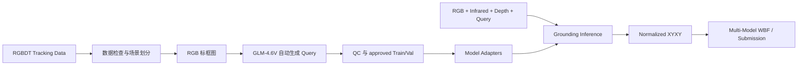

# RGBDT Multimodal Visual Grounding

基于统一 adapter 接口的 RGB、红外与深度视觉定位项目。模型层支持
`Qwen3-VL-8B-Instruct`、`InternVL3.5-8B`、`GroundingDINO-B`
与用于本地端到端测试的 mock 模型；推理入口通过 `--model` 选择 adapter，输出统一为
归一化边界框，最终可由 WBF 多模型加权框融合生成结果包。训练入口通过 `--model`
支持 `qwen3vl` 与 `internvl35`。

给定一组对齐的 RGB、Infrared、Depth 图像和英文 Query，模型输出目标的归一化边界框：

```text
[x1, y1, x2, y2],  0 <= x1 < x2 <= 1,  0 <= y1 < y2 <= 1
```

评价指标为 `ACC@0.5`，即预测框与真实框的 IoU 不低于 0.5 时计为命中。

## 方法概览



### 模型与适配层矩阵

| Adapter | 基座模型 | Revision | 输入模态 | 任务支持 | 核心视觉 / 微调配置 |
| --- | --- | --- | --- | --- | --- |
| `qwen3vl` | `Qwen/Qwen3-VL-8B-Instruct` | `0c351dd` | RGB + Infrared + Depth + Query | 训练 / 推理 | 原图 1080p 无损像素预算 (`3072*28*28`)，LoRA (r=16, α=48)，BF16 (SDPA) |
| `internvl35` | `OpenGVLab/InternVL3_5-8B-HF` | `741a7d0` | RGB + Infrared + Depth + Query | 训练 / 推理 | 动态切块 (`max_patches=12`)，LoRA (r=16, α=48)，BF16 (SDPA) |
| `groundingdino` | `IDEA-Research/grounding-dino-base` | `12bdfa3` | RGB + Query | 推理 (Zero-shot) | 原生判别式检测器，输出置信度得分供 WBF 融合 |

> 注：另内置 `mock` 确定性桩模型，用于纯 CPU 单元测试与端到端流水线验证。

### VLM 训练配置

适用于所有接入 `TrainableGroundingAdapter` 的 VLM 模型（Qwen3-VL、InternVL3.5）：

- **微调方法**：LoRA（Rank 16, Alpha 48, Dropout 0.05，作用于注意力与 MLP 投影层）
- **训练超参**：3 Epochs，Batch Size 1，梯度累积 16 步（等效 Batch Size 16）
- **优化器与调度**：AdamW（学习率 `1e-4`，Cosine 调度衰减至 `1e-5` 下限，Weight Decay 0.01，Warmup 0.05）
- **损失计算**：严格对 Prompt 与 Query 前缀做 `-100` 掩码，仅对 Target Bbox 计算 Causal LM Loss
- **验证与选优**：每轮 Epoch 自动在全量验证集上运行真实推理，以 `ACC@0.5` 优先、`val_loss` 平局辅助保存 Best Checkpoint
- **硬件与精度**：原生 BF16 混合精度，显存建议 $\ge 24\text{GB}$（支持离线实体 GPU、魔搭 DSW、AMD 实例或云端容器）

### 教师模型 (Teacher Model)

本项目使用 Z.ai (zai-org) 的 **GLM-4.6V** 作为教师模型，通过 Zhipu AI 提供的 API 为红框目标生成自然语言定位 Query。

### Query 自动生成

训练数据原始标注仅包含跟踪框坐标，无自然语言描述。系统将真实 bbox 以醒目色彩绘制于 RGB 图像之上，通过 OpenAI 兼容协议批量调用 `GLM-4.6V` 视觉问答接口生成目标描述，再经过确定性格式检查和质量控制发布为 `approved.json`。

生成链路具备场景级分片、请求限流、断点恢复、失败重试和显式发布机制。训练程序只接受完整通过 QC 的 approved 产物。

新风格计划链路将语义内容与句式结构解耦：先按预定义句式族建立语义组，
再抽样生成 400 个训练序列的场景卡，按场景支持度生成确定性 `style_plan`，
最后以扩展样本 ID（如 `001_00000001_q1`）逐条生成模板族 Query。生成入口
只接受带 `annotation_style` 字段的 expanded item，旧自由生成模式已移除。

### 定位协议与后处理

各模型 adapter 内部负责把原生输出统一转换为归一化 XYXY。Qwen3-VL 使用
`build_grounding_messages`，输出 0-1000 整数坐标，例如：

```text
<|box_start|>(125,240),(780,910)<|box_end|>
```

解析器将其转换为 `[0.125, 0.240, 0.780, 0.910]`。InternVL3.5 使用
`<box>[[x1,y1,x2,y2]]</box>` 并做同样的 0-1000 归一化；GroundingDINO
输出原始检测 score，供 WBF 使用。所有 adapter 的框都会经过合法性校验和 IoU 评估。

## 项目结构

```text
aicomp_grounding/
  models/               模型适配层：qwen3vl / internvl35 / groundingdino / mock
                        （统一 identity·指纹 / load / predict 接口）
  training_core.py      平台无关训练核心（cloud 与 offline 共用）
  inference_core.py     平台无关推理核心（items 加载/评估/分片合并）
  submission.py         官方模板校验与提交 ZIP 构建（含 CLI）
  annotation_state.py   标注计划、检查点、QC 与 approved 发布
  artifacts.py          JSON 内容指纹与元数据校验
  bbox.py               bbox 格式化、解析与 IoU
  config.py             跨模型公共配置（数据根/云端依赖/协议版本）
  images.py             数据图像引用检查
  inference_state.py    推理身份、LoRA 指纹与 run 元数据
  io.py                 原子 JSON 读写
  prompts.py            Qwen 定位 Prompt 协议（qwen3vl 适配器使用）
  query.py              Query 与训练样本结构校验
  query_style.py        Query 样式分类、审计指标与自适应消歧提示词
  sequence.py           Query 生成响应与文本 QC
  sharding.py           场景级均衡分片
  api_client.py         通用 OpenAI 协议客户端、限流与退避
  test_data.py          官方 Test 模板与索引合同
  training_state.py     训练身份、调度与 checkpoint 校验

offline/
  train.py              单机/离线训练入口（通用 training_core）
  infer.py              单机/离线推理与评估入口（--model 选适配器）
  rocm_env.sh           AMD MI300X 环境脚本（hipBLASLt / hardware queue / TunableOp 策略）

docs/
  architecture.md       仓库架构、adapter 约定与协作接入指南
  sop.md                GPU 实操 SOP（魔搭 DSW 全流程，唯一真相源）
  handoff.md            交接文档：当前状态、成绩与交接日志（唯一状态记录）
  data-contract.md      data/ 布局与派生产物合同（索引/审计的生成与组装）
  research.md           赛题规则与官方数据规范调研

scripts/
  prepare_rgbdt.py      RGBDT 图像检查、Depth JET 伪彩转换与切分索引生成（唯一生成器）
  filter_overlap.py     SHA-256 剔除与 Test 同源的 Train/Val 样本
  generate_queries.py   自适应消歧 Query 生成与 approved 发布
  audit_query_style.py  Query 样式分布与语义组审计
  upload_dataset.py     ModelScope 数据集上传工具

tests/                  离线单元测试与工作流契约测试
```

## 环境要求

- Linux bash/zsh（或兼容 Shell）
- Python 3.12
- NVIDIA CUDA 或 AMD ROCm GPU（训练与推理需要）
- Zhipu AI API Key，仅用于训练 Query 生成
- [RGBDT500](https://github.com/xuefeng-zhu5/RGBDT500) 数据集

本地开发依赖由 `requirements-lock.txt` 固定：

```bash
conda create -n qwen_vg python=3.12 -y
conda activate qwen_vg
python -m pip install -r requirements-lock.txt
```

### GPU 训练与推理环境

训练与推理可在预装 PyTorch 的 NVIDIA CUDA 或 AMD ROCm GPU 环境中执行。若平台镜像已提供
torch / torchvision / pillow，应优先沿用平台版本，避免覆盖镜像自带依赖；再按需补齐
VLM 适配层依赖：

```bash
pip install -r envs/gpu.txt \
    -i https://mirrors.aliyun.com/pypi/simple/ --trusted-host mirrors.aliyun.com
```

AMD MI300X 实例额外执行：

```bash
source offline/rocm_env.sh
```

## 训练数据来源

本项目训练数据来自 **RGBDT500** 官方数据集：

- GitHub: [xuefeng-zhu5/RGBDT500](https://github.com/xuefeng-zhu5/RGBDT500)
- Dataset website: [RGBDT500 Project Page](https://xuefeng-zhu5.github.io/RGBDT500/)
- 数据规模：500 个 RGB、Depth、Thermal Infrared 同步序列，共约 203.7K 组三模态图像

RGBDT500 对应 NeurIPS 2025 论文 **Collaborating Vision, Depth, and Thermal Signals for Multi-Modal Tracking: Dataset and Algorithm**。项目使用的本地训练输入包含其中 400 个序列，并通过 `prepare_rgbdt.py` 按场景划分为 320 个 Train 序列和 80 个 Val 序列。

数据下载页要求使用者同意其 research-only 数据许可。数据的下载、使用和再分发应遵守 [RGBDT500 官方页面](https://xuefeng-zhu5.github.io/RGBDT500/) 公布的许可条款；本仓库不重新分发原始数据。

引用信息：

```bibtex
@inproceedings{Zhu_RGBDT500,
  author    = {Xue-Feng Zhu and Tianyang Xu and Yifan Pan and Jinjie Gu and
               Xi Li and Jiwen Lu and Xiao-Jun Wu and Josef Kittler},
  title     = {Collaborating Vision, Depth, and Thermal Signals for
               Multi-Modal Tracking: Dataset and Algorithm},
  booktitle = {Advances in Neural Information Processing Systems},
  year      = {2025}
}
```

## 数据目录

数据不随仓库分发。预处理前应满足以下结构：

```text
data/
  Train/<sequence>/
    color/*.png
    infrared/*.png
    depth/*.png
    groundtruth.txt
  Test/
    Images/
      visible/*.png
      infrared/*.png
      depth/*.png
    queries/queries.json
```

正式预处理后生成：

```text
data/
  Processed/
    Train/<sequence>/depth_jet/*.png
    Test/depth_jet/*.png
  indexes/
    train.json
    val.json
    split_manifest.json
  audits/
    excluded_overlap.json
```

Depth 默认将 300-20,000 mm 固定映射为 8-bit JET 图像。固定尺度使不同场景间的颜色具有一致距离含义。

文件角色：

```text
本地流水线使用：
  data/indexes/train.json
  data/indexes/val.json
  data/indexes/split_manifest.json
  data/audits/excluded_overlap.json

云端运行只需要：
  data/Train + data/Test + data/Processed
  官方 data/Test/queries/queries.json（推理入口在内存映射路径）
  仓库 approved.json（训练标注）
```

`train.json`、`val.json`、`split_manifest.json`、`excluded_overlap.json` 是本地
生成标注/风格计划和做查重审计所需的中间产物（详见 `docs/data-contract.md`）；
approved 发布后，训练核心直接消费 approved 样本，不再依赖这些索引。云端不要在
启动阶段重新运行全量 SHA-256 审计或 Depth-JET 生成，否则会重复扫描约 44GB
图像并卡在 I/O 上。

## 完整复现流程

### 1. 数据预处理与切分

```bash
# 1. 批量生成本地 Depth-JET 伪彩图并构建切分 JSON 索引
#    （索引写入 data/indexes/；不要放到云端启动阶段）
python scripts/prepare_rgbdt.py --dataset-root data

# 2. 深度 SHA-256 查重只需要在本地首次审计时执行；执行前先确认命令参数
#    python scripts/filter_overlap.py --dataset-root data --overwrite-indexes
```

`prepare_rgbdt.py` 是索引的唯一生成器，输出 `data/indexes/train.json`、
`data/indexes/val.json` 与 `data/indexes/split_manifest.json`。
`filter_overlap.py` 才执行全量 SHA-256 字节级匹配并把审计日志写入
`data/audits/excluded_overlap.json`；该步骤只适合在本地
首次准备数据时执行，不应该放进云端日常训练/推理流程。

> 发布后的 approved 标注集会执行 Train/Val 与 Test 的同源 SHA-256 审计，避免同源帧进入训练。

### 2. Query 生成

在 bash 中设置 API Key：

```bash
export API_KEY="<your API key>"
```

执行生成与审计：

```bash
# 1. 运行 32 序列跨域抽样 Pilot（约 280 帧）
python -u scripts/generate_queries.py \
  --split train \
  --limit-sequences 32 \
  --concurrency 4 \
  --run-tag pilot-v4

# 2. 审计 Pilot 输出样式与语义组分布
python scripts/audit_query_style.py \
  --queries outputs/annotations/annot_<run_id>/train/merged.json \
  --full

# 3. 全量生成与 --publish 发布 approved.json
python -u scripts/generate_queries.py \
  --split train \
  --concurrency 4 \
  --publish \
  --run-tag v4-train

python -u scripts/generate_queries.py \
  --split val \
  --concurrency 4 \
  --publish \
  --run-tag v4-val
```

产物位于：

```text
outputs/annotations/<ANNOTATION_RUN_ID>/<split>/
  plan.json
  shards/
  merged.json
  qc.json
  approved.json
```

> 仓库通过 `.gitignore` 白名单分发 approved 标注资产；
> 这些文件保持字节级一致并纳入指纹校验。
> 其余生成中间文件（shards / merged 等）仍在本地生成，不入库。

默认开启 Resume。若存在失败项，保持原参数并增加 `--retry-failed --publish`，只重新请求失败帧。

### 3. LoRA 训练

先运行 CPU Preflight，确认 approved 数据和模型配置可用：

```bash
ANNOTATION_RUN_ID="<ANNOTATION_RUN_ID>"

python offline/train.py \
  --annotation-run-id "$ANNOTATION_RUN_ID" \
  --model qwen3vl \
  --seed 42 \
  --run-tag exp-qwen8-retrain \
  --preflight-only
```

运行单 batch 前向和反向冒烟测试：

```bash
python offline/train.py \
  --annotation-run-id "$ANNOTATION_RUN_ID" \
  --model qwen3vl \
  --seed 42 \
  --run-tag exp-qwen8-retrain \
  --smoke-test
```

启动完整 3 轮训练：

```bash
python offline/train.py \
  --annotation-run-id "$ANNOTATION_RUN_ID" \
  --model qwen3vl \
  --seed 42 \
  --run-tag exp-qwen8-retrain \
  --num-workers 4 \
  --checkpoint-interval 20
```

训练产物保存在：

```text
outputs/output_lora/<TRAINING_RUN_ID>/
  plan.json
  checkpoints/epoch_01/
  checkpoints/epoch_02/
  checkpoints/epoch_03/
  best/epoch_N/
  last/
  completed.json
```

训练支持按 batch 精确恢复（mid-epoch deterministic resume）。`best/` 对应全量验证集 `ACC@0.5` 最优（`val_loss` 平局辅助）的 Adapter。

### 4. 推理与评估

#### 4.1 验证集评估（Val 评估）

```bash
python offline/infer.py \
  --model qwen3vl \
  --test-json data/val.json \
  --data-dir data \
  --lora-path outputs/output_lora/<TRAINING_RUN_ID>/best/epoch_03 \
  --run-tag qwen8-val-eval
```

#### 4.2 官方测试集推理（单模型打榜）

单卡推荐 `--num-shards 1` + `--num-workers 2` + `--batch-size 4`，DataLoader 会预取图像
与 GPU 推理并行；GroundingDINO 继续使用 `--num-workers 4` + `--batch-size 8`：

```bash
# 1. Qwen3-VL-8B 推理
python offline/infer.py \
  --model qwen3vl \
  --test-json data/Test/queries/queries.json \
  --data-dir data \
  --lora-path outputs/output_lora/<QWEN_RUN_ID>/best/epoch_03 \
  --model-path /mnt/workspace/models/Qwen/Qwen3-VL-8B-Instruct \
  --num-shards 1 \
  --num-workers 2 \
  --batch-size 4 \
  --run-tag qwen-infer

# 2. InternVL3.5 推理
python offline/infer.py \
  --model internvl35 \
  --test-json data/Test/queries/queries.json \
  --data-dir data \
  --lora-path outputs/output_lora/<INTERNVL_RUN_ID>/best/epoch_03 \
  --model-path /mnt/workspace/models/OpenGVLab/InternVL3_5-8B-HF \
  --num-shards 1 \
  --num-workers 2 \
  --batch-size 4 \
  --run-tag internvl-infer

# 3. GroundingDINO 推理 (Zero-shot)
python offline/infer.py \
  --model groundingdino \
  --test-json data/Test/queries/queries.json \
  --data-dir data \
  --model-path /mnt/workspace/models/AI-ModelScope/grounding-dino-base \
  --num-shards 1 \
  --num-workers 4 \
  --batch-size 8 \
  --run-tag dino-infer
```

#### 4.3 多模型加权框融合 (WBF)

```bash
python -m aicomp_grounding.fusion.wbf \
  --predictions outputs/inference/<QWEN_INFER>/predictions.json outputs/inference/<INTERNVL_INFER>/predictions.json outputs/inference/<DINO_INFER>/predictions.json \
  --weights 1.0 1.0 0.8 \
  --scores "" "" "" \
  --test-json data/Test/queries/queries.json \
  --output-dir outputs/fusion
```

### 5. 构建提交包

若所有预测均有效，使用严格模式构建提交 ZIP：

```bash
python -m aicomp_grounding.submission \
  --test-json data/Test/queries/queries.json \
  --predictions outputs/fusion/<FUSION_ID>/fused_predictions.json \
  --output-dir outputs/submission/final_submit
```

严格模式要求：

- Query ID 与官方模板完全一致；
- 9,555 个 bbox 全部合法；
- 官方 Query 字段保持不变；
- ZIP 内只包含 `result.json`。

若存在解析异常项（None），可使用默认兜底框：

```bash
python -m aicomp_grounding.submission \
  --test-json data/Test/queries/queries.json \
  --predictions "outputs/inference/<RUN_ID>/predictions.json" \
  --output-dir "outputs/submission/<RUN_ID>" \
  --default-bbox 0 0 1 1 \
  --allow-fallback
```

## 运行产物与恢复

| 阶段 | 存储路径 | 恢复单位 |
| --- | --- | --- |
| Query 生成 | `outputs/annotations/<id>/<split>/` | 场景/帧 |
| LoRA 训练 | `outputs/output_lora/<id>/` | Batch / Epoch |
| 推理 | `outputs/inference/<id>/` | 增量预测 checkpoint |
| 提交 | `outputs/submission/<id>/` | 完整 ZIP |

Run ID 由数据、模型、Prompt、参数、seed 和 run-tag 共同确定。修改实验配置时应使用新的 run-tag，避免产物混淆。

## 测试

运行全部本地测试：

```bash
python -m unittest discover -s tests -v
```

测试覆盖数据准备、Test 模板合同、bbox、Query QC、API 请求、Resume/Retry、训练状态、推理分片和提交构建。

可额外执行语法编译检查：

```bash
python -m compileall aicomp_grounding scripts offline
```

## 模型与服务

- Student models:
  - [Qwen3-VL-8B-Instruct](https://huggingface.co/Qwen/Qwen3-VL-8B-Instruct)
  - [InternVL3.5-8B](https://huggingface.co/OpenGVLab/InternVL3_5-8B-HF)
  - [GroundingDINO-B](https://huggingface.co/IDEA-Research/grounding-dino-base)
- Query annotator: [GLM-4.6V](https://huggingface.co/zai-org/GLM-4.6V)
- Annotation API: [Zhipu AI](https://open.bigmodel.cn/)

模型、数据集及第三方服务分别遵循其原始许可证和使用条款。本仓库不分发评估数据、模型权重或 API 凭据。
