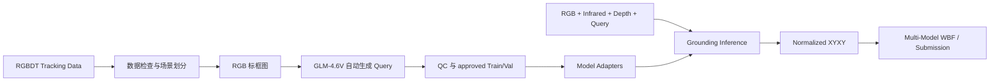

# RGBDT Multimodal Visual Grounding

基于统一 adapter 接口的 RGB、红外与深度视觉定位项目。当前模型层支持
`Qwen3-VL-8B-Instruct`、`InternVL3.5-8B`、`GroundingDINO-B` 与用于本地
端到端测试的 mock 模型；推理入口通过 `--model` 选择 adapter，输出统一为归一化
边界框，最终可由 WBF 多模型加权框融合生成结果包。训练入口通过 `--model`
支持 `qwen3vl` 与 `internvl35`。

给定一组对齐的 RGB、Infrared、Depth 图像和英文 Query，模型输出目标的归一化边界框：

```text
[x1, y1, x2, y2],  0 <= x1 < x2 <= 1,  0 <= y1 < y2 <= 1
```

评价指标为 `ACC@0.5`，即预测框与真实框的 IoU 不低于 0.5 时计为命中。

## 方法概览



### 模型适配层

| Adapter | 模型 | 输入 | 输出 |
| --- | --- | --- | --- |
| `qwen3vl` | `Qwen/Qwen3-VL-8B-Instruct` | RGB + Infrared + Depth + Query | 归一化 XYXY |
| `internvl35` | `OpenGVLab/InternVL3_5-8B-HF` | RGB + Infrared + Depth + Query | 归一化 XYXY |
| `groundingdino` | `IDEA-Research/grounding-dino-base` | RGB + Query | 归一化 XYXY + score |
| `mock` | 本地确定性模型 | 三模态接口兼容 | 归一化 XYXY + score |

### 训练支持状态

| Adapter | 当前训练状态 | 已记录训练参数 |
| --- | --- | --- |
| `qwen3vl` | 已实现 LoRA 训练 | 见下方 VLM 参数表 |
| `internvl35` | 已接入通用 LoRA 训练路径，待 GPU 冒烟 | 以 Qwen 满配为起点 |
| `groundingdino` | 仅 zero-shot 推理 | 仅支持推理接入 |
| `mock` | 不参与真实训练 | 仅用于本地端到端测试 |

### VLM LoRA 参数

Qwen3-VL 与 InternVL3.5 当前使用同一套 LoRA 起点。Qwen3-VL 具体参数如下：

| 配置 | 当前实现 |
| --- | --- |
| 基座模型 | `Qwen/Qwen3-VL-8B-Instruct` |
| 模型 revision | `0c351dd01ed87e9c1b53cbc748cba10e6187ff3b` |
| 输入 | RGB、Infrared、Depth 三张图像及英文 Query |
| 图像预算 | 每个模态 `3072 * 28 * 28` pixels（原图 1920×1080 无损） |
| 量化 | 无（原生 16-bit BF16 训练与推理） |
| 计算精度 | BF16 (SDPA) |
| 微调方法 | LoRA，rank 16，alpha 48，dropout 0.05 |
| LoRA 模块 | `q/k/v/o_proj`、`gate/up/down_proj` |
| 训练 | 3 epochs，batch size 1，gradient accumulation 16 |
| 优化器参数 | learning rate `1e-4`，cosine scheduler，weight decay `0.01`，warmup `0.05` |
| 训练设备 | Modal H100-80GB（32GB RAM，non-reentrant gradient checkpointing） |
| 推理设备 | Modal H100-80GB（多进程 Batch=4 / 8 卡分片） / 离线单 GPU 环境 |

### 教师模型 (Teacher Model)

本项目采用 Z.ai (zai-org) 最新开源的多模态大语言模型 **GLM-4.6V** 作为教师模型，负责训练数据的自然语言标签合成。
GLM-4.6V 是一个开放权重的先进多模态模型，在基础架构上原生支持极高分辨率和超长上下文，尤其在多模态空间推理、细粒度 OCR 识别和复杂视觉解析上表现优异。系统通过 Zhipu AI（智谱）提供的 API 接口调用该开源模型，准确提取图像中标记的目标边界框特征，并稳定生成高质量的自然语言定位 Query。

### Query 自动生成

训练数据原始标注仅包含跟踪框坐标，无自然语言描述。系统将真实 bbox 以醒目色彩绘制于 RGB 图像之上，通过 OpenAI 兼容协议批量调用 `GLM-4.6V` 视觉问答接口生成目标描述，再经过确定性格式检查和质量控制发布为 `approved.json`。

生成链路具备场景级分片、请求限流、断点恢复、失败重试和显式发布机制。训练程序只接受完整通过 QC 的 approved 产物。

### 定位协议与后处理

各模型 adapter 内部负责把原生输出统一转换为归一化 XYXY。Qwen3-VL 使用
`build_grounding_messages`，输出 0-1000 整数坐标，例如：

```text
<|box_start|>(125,240),(780,910)<|box_end|>
```

解析器将其转换为 `[0.125, 0.240, 0.780, 0.910]`。InternVL3.5 使用
`<box>[[x1,y1,x2,y2]]</box>` 并做同样的 0-1000 归一化；GroundingDINO
输出原始检测 score，供 WBF 使用。所有 adapter 的框都会经过合法性校验和 IoU 评估。

## 项目结构

```text
aicomp_grounding/
  models/               模型适配层：qwen3vl / internvl35 / groundingdino / mock
                        （统一 identity·指纹 / load / predict 接口）
  training_core.py      平台无关训练核心（cloud 与 offline 共用）
  inference_core.py     平台无关推理核心（items 加载/评估/分片合并）
  submission.py         官方模板校验与提交 ZIP 构建（含 CLI）
  annotation_state.py   标注计划、检查点、QC 与 approved 发布
  artifacts.py          JSON 内容指纹与元数据校验
  bbox.py               bbox 格式化、解析与 IoU
  config.py             跨模型公共配置（数据根/云端依赖/协议版本）
  images.py             数据图像引用检查
  inference_state.py    推理身份、LoRA 指纹与 run 元数据
  io.py                 原子 JSON 读写
  prompts.py            Qwen 定位 Prompt 协议（qwen3vl 适配器使用）
  query.py              Query 与训练样本结构校验
  sequence.py           Query 生成响应与文本 QC
  sharding.py           场景级均衡分片
  api_client.py         通用 OpenAI 协议客户端、限流与退避
  test_data.py          官方 Test 模板与索引合同
  training_state.py     训练身份、调度与 checkpoint 校验

cloud/
  train.py              云端端（Modal）：H100 LoRA 3 轮训练入口
  infer.py              云端端（Modal）：Batch-4 / 8 卡分片推理入口（--model 选适配器）

offline/
  train.py              离线端：单机训练入口（与云端共用 training_core）
  infer.py              离线端：通用单 GPU 推理与评估入口（--model 选适配器）

docs/
  architecture.md       仓库架构、adapter 约定与协作接入指南
  handoff.md            交接文档：当前状态、成绩与交接日志（唯一状态记录）
  research.md           任务规则、数据统计与多模态基准调研

scripts/
  prepare_rgbdt.py      RGBDT 检查、场景划分和 Depth JET 转换
  filter_overlap.py     SHA-256 剔除与 Test 同源的 Train/Val 样本
  generate_queries.py   自动 Query 生成与 approved 发布

tests/                  离线单元测试与工作流契约测试
```

## 环境要求

- Linux bash/zsh（或兼容 Shell）
- Python 3.12
- 可访问的 Modal 账户（仅训练与云端推理需要）
- Zhipu AI API Key，仅用于训练 Query 生成
- [RGBDT500](https://github.com/xuefeng-zhu5/RGBDT500) 数据集

本地开发与 CPU 校验依赖由 `requirements-lock.txt` 固定。Modal GPU 运行时依赖由
`aicomp_grounding/config.py` 中的 `MODAL_GPU_PACKAGES` 提供，并由 Modal 构建远端镜像。

```bash
conda create -n qwen_vg python=3.12 -y
conda activate qwen_vg
python -m pip install -r requirements-lock.txt

modal setup
modal volume create rgbdt-dataset
modal volume create hf-model-cache
```

### 离线 GPU 环境

离线推理可在预装 PyTorch 的 NVIDIA CUDA 或 AMD ROCm GPU 环境中执行。若平台镜像已提供
torch / torchvision / pillow，应优先沿用平台版本，避免覆盖镜像自带依赖；再按需补齐
VLM 适配层依赖。版本以 `aicomp_grounding/config.py` 中的 `MODAL_GPU_PACKAGES` 为基准：

```bash
pip install transformers==4.57.3 peft==0.19.1 accelerate==1.14.0 \
    qwen-vl-utils==0.0.14 \
    -i https://mirrors.aliyun.com/pypi/simple/ --trusted-host mirrors.aliyun.com
```

## 训练数据来源

本项目训练数据来自 **RGBDT500** 官方数据集：

- GitHub: [xuefeng-zhu5/RGBDT500](https://github.com/xuefeng-zhu5/RGBDT500)
- Dataset website: [RGBDT500 Project Page](https://xuefeng-zhu5.github.io/RGBDT500/)
- 数据规模：500 个 RGB、Depth、Thermal Infrared 同步序列，共约 203.7K 组三模态图像

RGBDT500 对应 NeurIPS 2025 论文 **Collaborating Vision, Depth, and Thermal Signals for Multi-Modal Tracking: Dataset and Algorithm**。当前项目使用的本地训练输入包含其中 400 个序列，并通过 `prepare_rgbdt.py` 按场景划分为 320 个 Train 序列和 80 个 Val 序列。

数据下载页要求使用者同意其 research-only 数据许可。数据的下载、使用和再分发应遵守 [RGBDT500 官方页面](https://xuefeng-zhu5.github.io/RGBDT500/) 公布的许可条款；本仓库不重新分发原始数据。

引用信息：

```bibtex
@inproceedings{Zhu_RGBDT500,
  author    = {Xue-Feng Zhu and Tianyang Xu and Yifan Pan and Jinjie Gu and
               Xi Li and Jiwen Lu and Xiao-Jun Wu and Josef Kittler},
  title     = {Collaborating Vision, Depth, and Thermal Signals for
               Multi-Modal Tracking: Dataset and Algorithm},
  booktitle = {Advances in Neural Information Processing Systems},
  year      = {2025}
}
```

## 数据目录

数据不随仓库分发。预处理前应满足以下结构：

```text
data/
  Train/<sequence>/
    color/*.png
    infrared/*.png
    depth/*.png
    groundtruth.txt
  Test/
    Images/
      visible/*.png
      infrared/*.png
      depth/*.png
    queries/queries.json
```

正式预处理后生成：

```text
data/
  Processed/
    Train/<sequence>/depth_jet/*.png
    Test/depth_jet/*.png
  train.json
  val.json
  test.json
  split_manifest.json
  excluded_overlap.json   # filter_overlap.py 剔除同源帧的审计日志
```

Depth 默认将 300-20,000 mm 固定映射为 8-bit JET 图像。固定尺度使不同场景间的颜色具有一致距离含义。

## 完整复现流程

### 1. 数据预处理

先进行不写文件的完整检查：

```bash
python scripts/prepare_rgbdt.py \
  --dataset-root data \
  --depth-scaling fixed \
  --dry-run
```

通过后执行正式预处理：

```bash
python scripts/prepare_rgbdt.py \
  --dataset-root data \
  --depth-scaling fixed \
  --overwrite-depth \
  --overwrite-indexes
```

当前数据的预期统计为：

```text
sequences=400
groundtruth_rows=4000
valid_samples=3903
excluded_invalid_bbox=97
```

官方 Test 模板包含 9,555 条 Query。项目固定校验其 canonical SHA-256：

```text
8fae701890bbbf05099e11ac8b2a3ead18990a496449355c9f09825d88ccfbbf
```

#### 1.1 剔除与 Test 同源的数据（哈希查重）

训练/验证样本若与 Test 图像字节相同（同源帧），会在训练前被剔除，避免数据泄漏——Test 里见过的帧绝不允许进训练。

```bash
python scripts/filter_overlap.py \
  --dataset-root data \
  --overwrite-indexes
```

`filter_overlap.py` 对 `data/Train/*/color/*.png` 与 `data/Test/Images/visible/*.png` 做 SHA-256 字节级匹配，从 `train.json` / `val.json` 删除命中样本，并将剔除记录写入 `data/excluded_overlap.json`（审计日志）。

> 当前 `annot_ac72f1d926bb2d23` 标注集已核查：Train 2,875 条、Val 719 条与 Test 的 SHA-256 匹配均为 **0**，无同源帧进入训练。

### 2. Query 生成

在 bash 中设置 API Key：

```bash
export API_KEY="<your API key>"
```

建议先选取少量场景验证 Prompt、API 和 QC：

```bash
python -u scripts/generate_queries.py \
  --split train \
  --limit-sequences 10 \
  --seed 42 \
  --concurrency 4 \
  --run-tag glm46v-pilot
```

完整生成并发布 Train/Val approved 产物：

```bash
python -u scripts/generate_queries.py \
  --split train \
  --seed 42 \
  --concurrency 4 \
  --run-tag glm46v-gen-r1 \
  --publish

python -u scripts/generate_queries.py \
  --split val \
  --seed 42 \
  --concurrency 4 \
  --run-tag glm46v-gen-r1 \
  --publish
```

产物位于：

```text
outputs/annotations/<ANNOTATION_RUN_ID>/<split>/
  plan.json
  shards/
  merged.json
  qc.json
  approved.json
```

> 仓库通过 `.gitignore` 白名单分发 `annot_ac72f1d926bb2d23` 的
> `train/val approved.json`；这些文件保持字节级一致并纳入指纹校验。
> 其余生成中间文件（shards / merged 等）仍在本地生成，不入库。

默认开启 Resume。若存在失败项，保持原参数并增加 `--retry-failed --publish`，只重新请求失败帧。

### 3. 上传到 Modal Volume

`rgbdt-dataset` 挂载到容器 `/data`，项目数据根目录固定为 `/data/data`。上传预处理数据：

```bash
modal volume put --force rgbdt-dataset data/Train data/Train
modal volume put --force rgbdt-dataset data/Test/Images data/Test/Images
modal volume put --force rgbdt-dataset data/Test/queries/queries.json data/Test/queries/queries.json
modal volume put --force rgbdt-dataset data/Processed/Train data/Processed/Train
modal volume put --force rgbdt-dataset data/Processed/Test/depth_jet data/Processed/Test/depth_jet
modal volume put --force rgbdt-dataset data/train.json data/train.json
modal volume put --force rgbdt-dataset data/val.json data/val.json
modal volume put --force rgbdt-dataset data/test.json data/test.json
modal volume put --force rgbdt-dataset data/split_manifest.json data/split_manifest.json
```

上传 approved 标注：

```bash
ANNOTATION_RUN_ID="annot_ac72f1d926bb2d23"

modal volume put --force rgbdt-dataset \
  "outputs/annotations/$ANNOTATION_RUN_ID" \
  "data/outputs/annotations/$ANNOTATION_RUN_ID"
```

### 4. LoRA 训练

先运行 CPU Preflight，确认 Volume、approved 数据和模型配置可用：

```bash
modal run cloud/train.py \
  --annotation-run-id "$ANNOTATION_RUN_ID" \
  --model qwen3vl \
  --seed 42 \
  --run-tag exp-h100-final \
  --preflight-only
```

运行单 batch 前向和反向冒烟测试：

```bash
modal run cloud/train.py \
  --annotation-run-id "$ANNOTATION_RUN_ID" \
  --model qwen3vl \
  --seed 42 \
  --run-tag exp-h100-final \
  --smoke-test
```

启动完整 3 轮训练：

```bash
modal run cloud/train.py \
  --annotation-run-id "$ANNOTATION_RUN_ID" \
  --model qwen3vl \
  --seed 42 \
  --run-tag exp-h100-final
```

训练产物保存在 Modal Volume：

```text
/data/data/output_lora/<TRAINING_RUN_ID>/
  plan.json
  checkpoints/epoch_01/
  checkpoints/epoch_02/
  checkpoints/epoch_03/
  best/epoch_N/
  last/
  completed.json
```

训练支持按 batch 精确恢复（mid-epoch deterministic resume）。`best/` 对应最低 validation loss 的 Adapter。

### 5. 推理与评估

#### 5.1 Modal 云端流水线推理（推荐）

验证集评估（Val 评估）：

```bash
modal run cloud/infer.py \
  --split val \
  --annotation-run-id "$ANNOTATION_RUN_ID" \
  --adapter-path "/data/data/output_lora/<TRAINING_RUN_ID>/best/epoch_03"
```

官方测试集推理与自动提交构建（支持 8 卡并行分片）：

```bash
modal run cloud/infer.py \
  --split test \
  --num-shards 8 \
  --adapter-path "/data/data/output_lora/<TRAINING_RUN_ID>/best/epoch_03"
```

#### 5.2 本地/离线单 GPU 推理（通用）

将训练产物下载到本地（默认 `outputs/output_lora/<id>/`）：

```bash
TRAINING_RUN_ID="train_89aa55f31aee5478"

modal volume get --force rgbdt-dataset \
  "data/output_lora/$TRAINING_RUN_ID" \
  "outputs/output_lora/$TRAINING_RUN_ID"
```

使用 `offline/infer.py` 进行离线推理：

```bash
BEST_ADAPTER="outputs/output_lora/$TRAINING_RUN_ID/best/epoch_03"

python offline/infer.py \
  --model-path Qwen/Qwen3-VL-8B-Instruct \
  --test-json data/test.json \
  --data-dir data \
  --lora-path "$BEST_ADAPTER" \
  --output-dir outputs/inference \
  --run-tag final-test
```

模型实际读取的是处理后的 `data/test.json`。`data/Test/queries/queries.json`
是官方提交模板，只在构建 `submission.zip` 时使用，不能作为 worker 的图像索引。
在验证集上运行时，应将 `--test-json` 指向对应的
`outputs/annotations/<ANNOTATION_RUN_ID>/val/approved.json`。

### 6. 构建提交包

若所有预测均有效，使用严格模式构建提交 ZIP：

```bash
python -m aicomp_grounding.submission \
  --test-json data/Test/queries/queries.json \
  --predictions "outputs/inference/<RUN_ID>/predictions.json" \
  --output-dir "outputs/submission/<RUN_ID>"
```

严格模式要求：

- Query ID 与官方模板完全一致；
- 9,555 个 bbox 全部合法；
- 官方 Query 字段保持不变；
- ZIP 内只包含 `result.json`。

若存在解析异常项（None），可使用默认兜底框：

```bash
python -m aicomp_grounding.submission \
  --test-json data/Test/queries/queries.json \
  --predictions "outputs/inference/<RUN_ID>/predictions.json" \
  --output-dir "outputs/submission/<RUN_ID>" \
  --default-bbox 0 0 1 1 \
  --allow-fallback
```

## 运行产物与恢复

| 阶段 | 本地或 Volume 路径 | 恢复单位 |
| --- | --- | --- |
| Query 生成 | `outputs/annotations/<id>/<split>/` | 场景/帧 |
| LoRA 训练 | `outputs/output_lora/<id>/`（Modal 中为 `/data/data/output_lora/<id>/`） | Batch / Epoch |
| 推理 | `outputs/inference/<id>/` | 增量预测 checkpoint |
| 提交 | `outputs/submission/<id>/` | 完整 ZIP |

Run ID 由数据、模型、Prompt、关键参数、seed 和 run-tag 共同确定。修改实验配置时应使用新的 run-tag，避免不同实验的产物混淆。

## 测试

运行全部本地测试：

```bash
python -m unittest discover -s tests -v
```

测试覆盖数据准备、Test 模板合同、bbox、Query QC、API 请求、Resume/Retry、训练状态、推理分片、提交构建和 Modal 入口编排。

可额外执行语法编译检查：

```bash
python -m compileall aicomp_grounding scripts cloud offline
```

## 模型与服务

- Student models:
  - [Qwen3-VL-8B-Instruct](https://huggingface.co/Qwen/Qwen3-VL-8B-Instruct)
  - [InternVL3.5-8B](https://huggingface.co/OpenGVLab/InternVL3_5-8B-HF)
  - [GroundingDINO-B](https://huggingface.co/IDEA-Research/grounding-dino-base)
- Query annotator: [GLM-4.6V](https://huggingface.co/zai-org/GLM-4.6V)
- Annotation API: [Zhipu AI](https://open.bigmodel.cn/)
- GPU runtime: [Modal](https://modal.com/)

模型、数据集及第三方服务分别遵循其原始许可证和使用条款。本仓库不分发评估数据、模型权重或 API 凭据。
