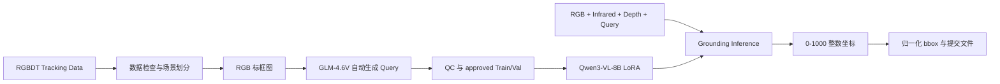

# RGBDT Visual Grounding with Qwen3-VL

基于 `Qwen3-VL-8B-Instruct` 的 RGB、红外与深度三模态视觉定位方案。项目覆盖数据预处理、训练 Query 自动生成、LoRA 微调、离线/并行推理、失败重试与竞赛提交构建。

给定一组对齐的 RGB、Infrared、Depth 图像和英文 Query，模型输出目标的归一化边界框：

```text
[x1, y1, x2, y2],  0 <= x1 < x2 <= 1,  0 <= y1 < y2 <= 1
```

竞赛评价指标为 `ACC@0.5`，即预测框与真实框的 IoU 不低于 0.5 时计为命中。

> README 中报告的 ACC 和 IoU 均为项目内部 Val 结果，不代表官方排行榜成绩。

## 方法概览



### 学生模型

| 配置 | 当前实现 |
| --- | --- |
| 基座模型 | `Qwen/Qwen3-VL-8B-Instruct` |
| 模型 revision | `0c351dd01ed87e9c1b53cbc748cba10e6187ff3b` |
| 输入 | RGB、Infrared、Depth 三张图像及英文 Query |
| 图像预算 | 每个模态 `3072 * 28 * 28` pixels（原图 1920×1080 无损） |
| 量化 | 无（原生 16-bit BF16 训练与推理） |
| 计算精度 | BF16 |
| 微调方法 | LoRA，rank 16，alpha 32，dropout 0.05 |
| LoRA 模块 | `q/k/v/o_proj`、`gate/up/down_proj` |
| 训练 | 2 epochs（本轮因预算以第 2 轮收尾），batch size 1，gradient accumulation 16 |
| 优化器参数 | learning rate `1e-4`，weight decay `0.01`，warmup `0.05` |
| 训练设备 | Modal A100-80GB |
| 推理设备 | 魔搭 DSW A10-24GB（BF16，离线推理） |

### 教师模型 (Teacher Model)

本项目采用 Z.ai (zai-org) 最新开源的多模态大语言模型 **GLM-4.6V** 作为教师模型，负责训练数据的自然语言标签合成。
GLM-4.6V 是一个开放权重的先进多模态模型，在基础架构上原生支持极高分辨率和超长上下文，尤其在多模态空间推理、细粒度 OCR 识别和复杂视觉解析上表现优异。系统通过 Zhipu AI（智谱）提供的 API 接口调用该开源模型，准确提取图像中标记的目标边界框特征，并稳定生成高质量的自然语言定位 Query。

### Query 自动生成

训练数据原始标注仅包含跟踪框坐标，无自然语言描述。系统将真实 bbox 以醒目色彩绘制于 RGB 图像之上，通过 OpenAI 兼容协议批量调用 `GLM-4.6V` 视觉问答接口生成目标描述，再经过确定性格式检查和质量控制发布为 `approved.json`。

生成链路具备场景级分片、请求限流、断点恢复、失败重试和显式发布机制。训练程序只接受完整通过 QC 的 approved 产物。

### 定位协议

训练与推理共享同一套 Prompt。模型按照 Qwen Grounding 格式输出 0-1000 整数坐标，例如：

```text
<|box_start|>(125,240),(780,910)<|box_end|>
```

解析器将其转换为 `[0.125, 0.240, 0.780, 0.910]`，随后进行 bbox 合法性校验和 IoU 评估。

## 项目结构

```text
aicomp_grounding/
  annotation_state.py   标注计划、检查点、QC 与 approved 发布
  artifacts.py          JSON 内容指纹与元数据校验
  bbox.py               bbox 格式化、解析、校验与 IoU
  config.py             模型 revision、像素预算与云端依赖
  images.py             数据图像引用检查
  inference_state.py    推理计划、分片、恢复、重试与评估
  io.py                 原子 JSON 读写
  prompts.py            训练和推理共享 Prompt
  query.py              Query 与训练样本结构校验
  sequence.py           Query 生成响应与文本 QC
  sharding.py           场景级均衡分片
  api_client.py         通用 OpenAI 协议客户端、限流与退避
  test_data.py          官方 Test 模板与索引合同
  training_state.py     训练身份、调度与 checkpoint 校验

scripts/
  prepare_rgbdt.py      RGBDT 检查、场景划分和 Depth JET 转换
  filter_overlap.py     SHA-256 剔除与 Test 同源的 Train/Val 样本
  generate_queries.py   自动 Query 生成与 approved 发布
  build_submission.py   官方模板校验与提交 ZIP 构建

run_inference.py        本地单 GPU 推理与评估入口
train_modal.py          Modal A100-80GB LoRA 训练入口
tests/                  离线单元测试与工作流契约测试
```

## 环境要求

- Linux bash/zsh（或兼容 Shell）
- Python 3.10
- 可访问的 Modal 账户（仅训练需要）
- Zhipu AI API Key，仅用于训练 Query 生成
- [RGBDT500](https://github.com/xuefeng-zhu5/RGBDT500) 数据集
- 单张 24GB+ 显存 GPU 用于推理

本地依赖由 `requirements-lock.txt` 固定。GPU 容器依赖固定在 `aicomp_grounding/config.py`，由 Modal 构建远端镜像。

```bash
conda create -n qwen_vg python=3.10 -y
conda activate qwen_vg
python -m pip install -r requirements-lock.txt

modal setup
modal volume create rgbdt-dataset
modal volume create hf-model-cache
```

### 魔搭 DSW 推理环境

Test 推理在 ModelScope DSW（A10-24GB，离线）执行。镜像自带 torch 2.3.0（CUDA 12.1），**不升级 torch**，其余推理库走阿里云镜像安装：

```bash
bash setup_env.sh
```

`setup_env.sh` 安装 `transformers==4.57.0`、`peft`、`accelerate`、`pillow`、`safetensors`、`qwen-vl-utils`，并卸载冲突的 `autoawq`。镜像打包路径约定：

```text
/mnt/workspace/offline_inference_pack/   # 推理包根目录
  model/Qwen3-VL-8B-Instruct/            # 基座模型（离线）
  best/epoch_02/                         # LoRA adapter
  data/                                  # 预处理数据与索引
  run_inference.py
  build_submission.py
```

数据集、API Key 和运行输出均被 `.gitignore` 排除，不应提交到代码仓库。

## 训练数据来源

本项目训练数据来自 **RGBDT500** 官方数据集：

- GitHub: [xuefeng-zhu5/RGBDT500](https://github.com/xuefeng-zhu5/RGBDT500)
- Dataset website: [RGBDT500 Project Page](https://xuefeng-zhu5.github.io/RGBDT500/)
- 数据规模：500 个 RGB、Depth、Thermal Infrared 同步序列，共约 203.7K 组三模态图像

RGBDT500 对应 NeurIPS 2025 论文 **Collaborating Vision, Depth, and Thermal Signals for Multi-Modal Tracking: Dataset and Algorithm**。当前项目使用的本地训练输入包含其中 400 个序列，并通过 `prepare_rgbdt.py` 按场景划分为 320 个 Train 序列和 80 个 Val 序列。

数据下载页要求使用者同意其 research-only 数据许可。数据的下载、使用和再分发应遵守 [RGBDT500 官方页面](https://xuefeng-zhu5.github.io/RGBDT500/) 公布的许可条款；本仓库不重新分发原始数据。

引用信息：

```bibtex
@inproceedings{Zhu_RGBDT500,
  author    = {Xue-Feng Zhu and Tianyang Xu and Yifan Pan and Jinjie Gu and
               Xi Li and Jiwen Lu and Xiao-Jun Wu and Josef Kittler},
  title     = {Collaborating Vision, Depth, and Thermal Signals for
               Multi-Modal Tracking: Dataset and Algorithm},
  booktitle = {Advances in Neural Information Processing Systems},
  year      = {2025}
}
```

## 数据目录

数据不随仓库分发。预处理前应满足以下结构：

```text
data/
  Train/<sequence>/
    color/*.png
    infrared/*.png
    depth/*.png
    groundtruth.txt
  Test/
    Images/
      visible/*.png
      infrared/*.png
      depth/*.png
    queries/queries.json
```

正式预处理后生成：

```text
data/
  Processed/
    Train/<sequence>/depth_jet/*.png
    Test/depth_jet/*.png
  train.json
  val.json
  test.json
  split_manifest.json
  excluded_overlap.json   # filter_overlap.py 剔除同源帧的审计日志
```

Depth 默认将 300-20,000 mm 固定映射为 8-bit JET 图像。固定尺度使不同场景间的颜色具有一致距离含义。

## 完整复现流程

### 1. 数据预处理

先进行不写文件的完整检查：

```bash
python scripts/prepare_rgbdt.py \
  --dataset-root data \
  --depth-scaling fixed \
  --dry-run
```

通过后执行正式预处理：

```bash
python scripts/prepare_rgbdt.py \
  --dataset-root data \
  --depth-scaling fixed \
  --overwrite-depth \
  --overwrite-indexes
```

当前数据的预期统计为：

```text
sequences=400
groundtruth_rows=4000
valid_samples=3903
excluded_invalid_bbox=97
```

官方 Test 模板包含 9,555 条 Query。项目固定校验其 canonical SHA-256：

```text
8fae701890bbbf05099e11ac8b2a3ead18990a496449355c9f09825d88ccfbbf
```

#### 1.1 剔除与 Test 同源的数据（哈希查重）

训练/验证样本若与 Test 图像字节相同（同源帧），会在训练前被剔除，避免数据泄漏——Test 里见过的帧绝不允许进训练。

```bash
python scripts/filter_overlap.py \
  --dataset-root data \
  --overwrite-indexes
```

`filter_overlap.py` 对 `data/Train/*/color/*.png` 与 `data/Test/Images/visible/*.png` 做 SHA-256 字节级匹配，从 `train.json` / `val.json` 删除命中样本，并将剔除记录写入 `data/excluded_overlap.json`（审计日志）。

> 当前 `annot_ac72f1d926bb2d23` 标注集已核查：Train 2,875 条、Val 719 条与 Test 的 SHA-256 匹配均为 **0**，无同源帧进入训练。

### 2. Query 生成

在 bash 中设置 API Key：

```bash
export API_KEY="<your API key>"
```

建议先选取少量场景验证 Prompt、API 和 QC：

```bash
python -u scripts/generate_queries.py \
  --split train \
  --limit-sequences 10 \
  --seed 42 \
  --concurrency 4 \
  --run-tag glm46v-pilot
```

完整生成并发布 Train/Val approved 产物：

```bash
python -u scripts/generate_queries.py \
  --split train \
  --seed 42 \
  --concurrency 4 \
  --run-tag glm46v-gen-r1 \
  --publish

python -u scripts/generate_queries.py \
  --split val \
  --seed 42 \
  --concurrency 4 \
  --run-tag glm46v-gen-r1 \
  --publish
```

产物位于：

```text
outputs/annotations/<ANNOTATION_RUN_ID>/<split>/
  plan.json
  shards/
  merged.json
  qc.json
  approved.json
```

默认开启 Resume。若存在失败项，保持原参数并增加 `--retry-failed --publish`，只重新请求失败帧。

### 3. 上传到 Modal Volume

`rgbdt-dataset` 挂载到容器 `/data`，项目数据根目录固定为 `/data/data`。上传预处理数据：

```bash
modal volume put --force rgbdt-dataset data/Train data/Train
modal volume put --force rgbdt-dataset data/Test/Images data/Test/Images
modal volume put --force rgbdt-dataset data/Test/queries/queries.json data/Test/queries/queries.json
modal volume put --force rgbdt-dataset data/Processed/Train data/Processed/Train
modal volume put --force rgbdt-dataset data/Processed/Test/depth_jet data/Processed/Test/depth_jet
modal volume put --force rgbdt-dataset data/train.json data/train.json
modal volume put --force rgbdt-dataset data/val.json data/val.json
modal volume put --force rgbdt-dataset data/test.json data/test.json
modal volume put --force rgbdt-dataset data/split_manifest.json data/split_manifest.json
```

上传 approved 标注：

```bash
ANNOTATION_RUN_ID="annot_ac72f1d926bb2d23"

modal volume put --force rgbdt-dataset \
  "outputs/annotations/$ANNOTATION_RUN_ID" \
  "data/outputs/annotations/$ANNOTATION_RUN_ID"
```

### 4. LoRA 训练

先运行 CPU Preflight，确认 Volume、approved 数据和模型配置可用：

```bash
modal run train_modal.py \
  --annotation-run-id "$ANNOTATION_RUN_ID" \
  --seed 42 \
  --run-tag bf16-lora-r2 \
  --preflight-only
```

运行单 batch 前向和反向冒烟测试：

```bash
modal run train_modal.py \
  --annotation-run-id "$ANNOTATION_RUN_ID" \
  --seed 42 \
  --run-tag bf16-lora-r2 \
  --smoke-test
```

启动完整训练：

```bash
modal run train_modal.py \
  --annotation-run-id "$ANNOTATION_RUN_ID" \
  --seed 42 \
  --run-tag bf16-lora-r2
```

训练产物保存在 Modal Volume：

```text
/data/data/output_lora/<TRAINING_RUN_ID>/
  plan.json
  checkpoints/epoch_01/
  checkpoints/epoch_02/
  best/epoch_N/
  last/
  completed.json
```

训练默认支持按 epoch 恢复。`best/` 对应最低 validation loss 的 Adapter；当前运行选择 `epoch_02`。

### 5. 下载 Adapter 与 Val 评估

将训练产物下载到本地镜像目录（默认 `outputs/output_lora/<id>/`）：

```bash
TRAINING_RUN_ID="train_9e468a454061153b"

modal volume get --force rgbdt-dataset \
  "data/output_lora/$TRAINING_RUN_ID" \
  "outputs/output_lora/$TRAINING_RUN_ID"
```

使用 `run_inference.py` 进行 Val 推理与评估（Val 必须用 approved 产物，不能用纯索引 `data/val.json`）：

```bash
ANNOTATION_RUN_ID="annot_ac72f1d926bb2d23"
BEST_ADAPTER="outputs/output_lora/$TRAINING_RUN_ID/best/epoch_02"

# LoRA Adapter（Val 评估）
python run_inference.py \
  --test-json outputs/annotations/$ANNOTATION_RUN_ID/val/approved.json \
  --annotation-run-id "$ANNOTATION_RUN_ID" \
  --lora-path "$BEST_ADAPTER" \
  --limit 300 \
  --output-dir outputs/inference \
  --run-tag bf16-lora-r2-val
```

Val 结束后从 `outputs/inference/<RUN_ID>/summary.json` 中读取 `ACC@0.5`、Mean IoU 和解析失败数。

### 6. Test 推理（魔搭 DSW）

Test 入口直接读取 `data/test.json`，不能传 `--annotation-run-id`（Test 推理禁止 annotation_run_id）。在魔搭 DSW 推理包目录执行：

```bash
cd /mnt/workspace/offline_inference_pack
python run_inference.py \
  --model-path model/Qwen3-VL-8B-Instruct \
  --test-json data/test.json \
  --lora-path best/epoch_02 \
  --data-dir data \
  --output-dir outputs/inference \
  --run-tag bf16-lora-r2-test
```

- `--max-pixels` 默认 2408448（训练同款 3072 patches）。若 A10-24GB 显存不足（BF16 推理约 21-23GB），可降到 `--max-pixels 1505280`（1920 patches）兜底。
- `--resume` 开启后，相同参数重新运行会从 `predictions.json` 增量续跑。

### 7. 失败重试

当前运行的 13 个失败项（解析 None）已通过 `--default-bbox` 兜底框策略完成提交。若后续运行出现批量失败，可手动编写 Retry 脚本并基于已有 `predictions.json` 重新发起。

### 8. 构建提交包

若所有预测均有效，使用严格模式构建：

```bash
python scripts/build_submission.py \
  --test-json data/Test/queries/queries.json \
  --predictions "outputs/inference/<RUN_ID>/predictions.json" \
  --output-dir "outputs/submission/<RUN_ID>"
```

严格模式要求：

- Query ID 与官方模板完全一致；
- 9,555 个 bbox 全部合法；
- 官方 Query 字段保持不变；
- ZIP 内只包含 `result.json`。

当前运行仍有 13 个失败项（解析 None），按既定策略填入兜底框 `[0, 0, 1, 1]`：

```bash
python scripts/build_submission.py \
  --test-json data/Test/queries/queries.json \
  --predictions "outputs/inference/<RUN_ID>/predictions.json" \
  --output-dir "outputs/submission/<RUN_ID>" \
  --default-bbox 0 0 1 1 \
  --allow-fallback
```

`build_submission.py` 统一输出 `result.json` 与 `submission.zip`，确认日志显示 `invalid=13`（或实际失败数）后即可提交 `outputs/submission/<RUN_ID>/submission.zip`。

## 运行产物与恢复

| 阶段 | 本地或 Volume 路径 | 恢复单位 |
| --- | --- | --- |
| Query 生成 | `outputs/annotations/<id>/<split>/` | 场景/帧 |
| LoRA 训练 | `/data/data/output_lora/<id>/` | Epoch |
| 本地推理 | `outputs/inference/<id>/` | 增量预测 checkpoint |
| 提交 | `outputs/submission/<id>/` | 完整 ZIP |

Run ID 由数据、模型、Prompt、关键参数、seed 和 run-tag 共同确定。修改实验配置时应使用新的 run-tag，避免不同实验的产物混淆。

## 测试

运行全部本地测试：

```bash
python -m unittest discover -s tests -v
```

测试覆盖数据准备、Test 模板合同、bbox、Query QC、API 请求、Resume/Retry、训练状态、推理分片、提交构建和 Modal 入口编排。

可额外执行语法编译检查：

```bash
python -m compileall aicomp_grounding scripts train_modal.py run_inference.py
```

## 模型与服务

- Base model: [Qwen3-VL-8B-Instruct](https://huggingface.co/Qwen/Qwen3-VL-8B-Instruct)
- Query annotator: [GLM-4.6V](https://huggingface.co/zai-org/GLM-4.6V)
- Annotation API: [Zhipu AI](https://open.bigmodel.cn/)
- GPU runtime: [Modal](https://modal.com/)

模型、数据集及第三方服务分别遵循其原始许可证和使用条款。本仓库不分发竞赛数据、模型权重或 API 凭据。