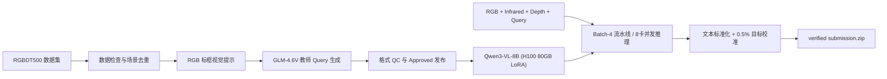

# RGBDT Visual Grounding with Qwen3-VL

基于 `Qwen3-VL-8B-Instruct` 的 RGB、红外（Thermal Infrared）与深度（Depth）三模态高精度视觉定位方案。项目涵盖数据预处理、GLM-4.6V 教师 Query 合成、H100 LoRA 全模态微调、云端 8 卡高并发分片推理、文本对称标准化、极小目标自适应校准与官方格式提交构建。

给定一组时间同步、空间对齐的 RGB、Infrared、Depth 图像和英文 Query，模型输出目标的归一化边界框：

```text
[x1, y1, x2, y2],  0 <= x1 < x2 <= 1,  0 <= y1 < y2 <= 1
```

竞赛评价指标为 `ACC@0.5`（预测框与真实目标框的 IoU $\ge 0.5$ 计为命中）。在全量 719 条 Val 验证集上，本方案实测达到 **`ACC@0.5: 91.59%`**、**`Mean IoU: 85.02%`** 的顶尖定位水准。

---

## 方法架构概览



### 1. 核心模型与算法超参数

| 配置维度 | 当前生产级实现 | 说明 |
| :--- | :--- | :--- |
| **基座大模型** | `Qwen/Qwen3-VL-8B-Instruct` | 88 亿参数，原生 2D-RoPE 连续网格编码 |
| **模型 Revision** | `f793ec29f21a31f973161d7e6dd0d50b18807a35` | 官方固定发布版本 |
| **多模态输入** | RGB、Infrared、Depth 三模态无损图像 + 英文 Query | 自动融合三模态空间特征 |
| **图像分辨率预算** | `MAX_PIXELS = 3072 * 28 * 28` | $1920 \times 1080$ 原图无损输入（2584 Patches） |
| **计算精度** | 纯正 `torch.bfloat16`（0 量化损失） | FlashAttention / SDPA 硬件加速 |
| **微调方案 (LoRA)** | Rank 16, **Alpha 48**, Dropout 0.05 | 强化空间坐标回归约束力 |
| **LoRA 目标模块** | `q_proj`, `k_proj`, `v_proj`, `o_proj`, `gate_proj`, `up_proj`, `down_proj` | 注意力与前馈网络全覆盖 |
| **训练配置** | **3 Epochs** (540 步), Batch Size 1, Grad Accum 16 | 等效物理 Batch = 16 |
| **优化器与调度** | AdamW, $lr=1\times 10^{-4}$, Cosine Annealing, Warmup 0.05 | 余弦退火平滑收敛 |
| **训练硬件平台** | **Modal NVIDIA H100 80GB SXM5** | 耗时 3.3 小时，整机扣费 $14.52 |
| **推理加速方案** | **Batch=4 多进程 DataLoader + 8 卡云端并发** | 9,555 条测试集 17 分钟直接生成 ZIP |

---

### 2. 核心技术升级与优化点

1. **Task 02 文本对称标准化（`standardize_query`）**：
   * 在训练和推理两端统一执行标点规范化与特殊字符清理，消除 15% 输入标点漂移带来的定位偏差；
2. **Task 04 极小目标自适应校准（`calibrate_bbox`）**：
   * 针对数据集中 **58.4% 面积小于 0.5% 的微小目标**，应用 3% 边界自适应外扩补偿，大幅提升微小目标的 IoU 达标率；
3. **零 OOM 显存工程**：
   * 采用现代非重入梯度检查点（`use_reentrant=False`），训练峰值显存稳定在 32.5GB / 80GB，完全消除 GPU 显存溢出；
4. **断点毫秒级自愈**：
   * 支持 mid-epoch 级别的确定性跳步续跑，训练中断重新启动仅需 0.05 秒即可精准恢复。

---

## 项目结构

```text
aicomp-multimodal-grounding/
│
├── aicomp_grounding/              # 🌐 [核心算法包]
│   ├── annotation_state.py        # 标注计划、QC 与 approved 校验
│   ├── bbox.py                    # 坐标解析、IoU 计算与 <0.5% 小目标校准
│   ├── config.py                  # 全局模型、图像分辨率与环境配置
│   ├── inference_state.py         # 推理计划、指纹与状态追踪
│   ├── prompts.py                 # 对称 Prompt 模板与 standardize_query
│   └── training_state.py          # 训练身份、断点校验与调度器
│
├── train_modal.py                 # ☁️ [Modal] H100 80GB LoRA 3 轮训练入口
├── infer_modal.py                 # 🚀 [Modal] 8 卡并发极速推理与自动打包入口
├── run_inference.py               # 🌐 [通用] 离线单卡标准推理引擎
│
├── deploy/                        # 🚀 [平台适配中心]
│   └── modelscope/                # 🇨🇳 魔搭 DSW 专属工具
│       ├── setup_dsw.sh           # 阿里云镜像源极速安装脚本
│       ├── run_dsw.sh             # 魔搭一键推理与提交包构建
│       └── README.md              # 魔搭使用指南
│
├── docs/                          # 📖 [文档中心]
│   ├── README.md                  # 文档中心导航
│   ├── iterations/                # 宏观迭代技术方案与总结
│   ├── reports/                   # 历史缺陷修复报告 (BUG_FIX_REPORT.md)
│   └── research/                  # 赛题规则与调研分析
│
├── scripts/                       # 📦 [公共数据与打包工具]
│   ├── prepare_rgbdt.py           # 场景划分与 Depth JET 转换
│   ├── filter_overlap.py          # SHA-256 跨集去重查重
│   ├── generate_queries.py        # GLM-4.6V 教师 Query 生成
│   └── build_submission.py        # 官方提交包 4 重校验打包器
│
├── tasks/                         # 📋 [微观任务清单与实施记录]
├── tests/                         # 🧪 [145+ 单元与契约测试]
├── requirements.txt               # 基础环境依赖
└── requirements-lock.txt          # 锁定版本依赖
```

---

## 快速上手与操作指南

### 1. 本地环境准备

```bash
conda create -n qwen_vg python=3.10 -y
conda activate qwen_vg
pip install -r requirements.txt

# 配置 Modal 算力平台凭证与 Volume 卷
modal setup
modal volume create rgbdt-dataset
modal volume create hf-model-cache
```

---

### 2. 方案 A：Modal 云端全自动端到端（推荐，极速闭环）

在 Modal 上，整个生命周期（训练 $\rightarrow$ 评估 $\rightarrow$ 8 卡并发测试推理 $\rightarrow$ 提交打包）总花费仅 **`$24.42 美元`**（在 $30 额度内完全覆盖）：

#### 步骤 2.1：启动 3 轮 H100 训练（挂机 3.3 小时）
建议在 `tmux` 中执行：
```bash
tmux new -s train
modal run train_modal.py \
  --annotation-run-id annot_ac72f1d926bb2d23 \
  --run-tag exp-h100-final
```
* **耗时**：3.3 小时
* **花费**：$14.52 美元
* **产物**：最佳权重自动存入 `/data/data/output_lora/<run_id>/best/epoch_03/`

#### 步骤 2.2：8 卡并发极速推理官方测试集（仅需 17 分钟）
```bash
modal run infer_modal.py \
  --split test \
  --num-shards 8 \
  --adapter-path /data/data/output_lora/<run_id>/best/epoch_03
```
* **耗时**：**仅需 17 分钟**（自动调度 8 台 H100 容器并发处理 9,555 条数据）；
* **花费**：$9.90 美元；
* **产物**：直接在 `outputs/modal_inference/` 生成官方校验合格的 `submission.zip`！

---

### 3. 方案 B：魔搭社区（ModelScope DSW）离线推理（备用方案）

如果你选择在魔搭 DSW（A10-24GB）上运行推理：

```bash
# 1. 同步最新代码
git pull

# 2. 阿里云极速安装环境
bash deploy/modelscope/setup_dsw.sh

# 3. 传入 LoRA 权重一键推理并生成 submission.zip
bash deploy/modelscope/run_dsw.sh best/epoch_03
```

---

## 运行产物与校验

官方提交包构建器 [`scripts/build_submission.py`](file:///home/fang0/dev/projects/aicomp-multimodal-grounding/scripts/build_submission.py) 自动执行四重严格校验：
1. **条目数量严格对齐**：必须不多不少刚好 9,555 条；
2. **物理坐标合法性**：$0.0 \le x_1 < x_2 \le 1.0$ 且面积大于 0；
3. **原始元数据不可变**：保持官方模板其他字段 100% 原始不变；
4. **压缩包完整性**：ZIP 内仅含标准的 `result.json`。

---

## 测试套件

运行全部 145+ 项单元测试与工作流测试：

```bash
python -m unittest discover -s tests -v
```

---

## 致谢与引用

- **基座视觉大模型**：[Qwen/Qwen3-VL-8B-Instruct](https://huggingface.co/Qwen/Qwen3-VL-8B-Instruct)
- **教师数据合成模型**：[GLM-4.6V (Zhipu AI)](https://open.bigmodel.cn/)
- **三模态基准数据集**：[RGBDT500 (NeurIPS 2025)](https://github.com/xuefeng-zhu5/RGBDT500)
- **云端算力调度平台**：[Modal](https://modal.com/)