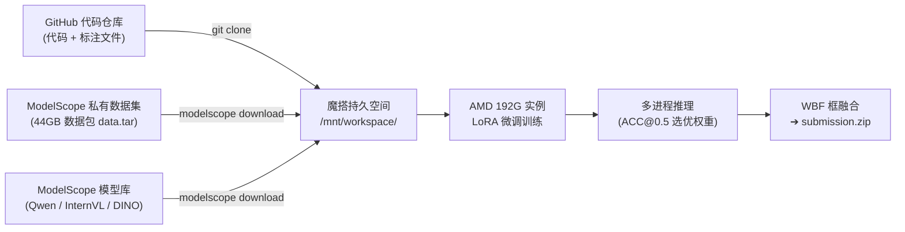

---
tags:
  - aicomp
  - multimodal
  - grounding
  - vlm
  - sop
  - modelscope
  - modal
updated: 2026-08-23
---

# RGBDT 视觉定位竞赛：全流程 SOP 与多平台实操指南

> 本文档为团队协作操作指南，涵盖数据准备、云端分发、魔搭（ModelScope）与 Modal 平台的训练、多进程推理、WBF 融合及提交包（`submission.zip`）构建。

---

## 零、 核心分发规范：代码、数据与模型解耦



| 资产类型 | 托管平台 | 拉取方式 | 说明 |
| :--- | :--- | :--- | :--- |
| **项目代码** | GitHub 私有仓库 | `git clone` (Token 鉴权) | 代码与标注文件，随时 `git pull` 同步。 |
| **数据集 (44GB)** | ModelScope 私有数据集 | `modelscope download --dataset` | 机房内网下载，避免网页端传输大文件。 |
| **基座模型** | ModelScope 官方模型库 | `modelscope download --model` | 官方原生托管，断点续传。 |

---

## 一、 第一阶段：本地数据准备与私有云端托管（仅负责人执行）

> [!NOTE]
> **团队协作提示**：
> 完整数据集已由负责人预处理并托管至魔搭私有仓库。**队友无需在本地重复下载、清洗或上传数据**。联系负责人（Fang0）开通私有数据集权限后，**直接从【第二阶段：魔搭社区 (ModelScope DSW) 操作流程】开始执行即可**。

以下步骤仅供数据维护者或需要重新构建数据集时参考：

### 1. 克隆项目与安装基础依赖
```bash
git clone https://YOUR_GITHUB_TOKEN@github.com/FanGou-code/aicomp-multimodal-grounding.git
cd aicomp-multimodal-grounding
pip install -r requirements.txt
```

### 2. 原始数据填充与预处理
将官方 `Train/`（400 个序列）与 `Test/` 放入 `data/` 目录：
```bash
python scripts/prepare_rgbdt.py --dataset-root data --skip-test-validation
python scripts/build_indexes.py --data-dir data
```

### 3. 打包数据
```bash
tar -cf /home/fang0/dev/projects/data.tar -C data .
```

### 4. 上传至魔搭私有数据集仓库
```bash
python scripts/upload_dataset.py --repo-id Fang001/rgbdt-grounding-dataset --token YOUR_MODELSCOPE_TOKEN --path /home/fang0/dev/projects/data.tar
```

### 5. 重新生成官方风格 Query 标注（新标注轮次，仅负责人执行）

> 背景：实测官方测试集 Query 平均 10.3 词、66.3% 含空间关系词、33.5% 含序数词，
> 而旧标注（GLM 生成）平均仅 6 词、约 26% 空间词，风格分布漂移已被确认为
> 测试集成绩瓶颈。生成 prompt 已重写为官方风格导向，重生成即为此目的。

```bash
export API_KEY="<your API key>"

# a. Pilot：先跑 10 个序列验证新 prompt 的产出风格
python -u scripts/generate_queries.py \
  --split train --limit-sequences 10 --seed 42 --concurrency 4 \
  --run-tag glm46v-style-pilot

# b. 审计风格分布是否对齐官方测试集（目标：均值 ≈10 词、either ≥ 60%）
python scripts/audit_query_style.py \
  --queries outputs/annotations/<PILOT_RUN_ID>/train/merged.json \
  --reference data/Test/queries/queries.json

# c. 审计达标并人工抽检空间关系无幻觉后，全量生成并发布 Train/Val
python -u scripts/generate_queries.py \
  --split train --seed 42 --concurrency 4 --run-tag glm46v-gen-r2 --publish
python -u scripts/generate_queries.py \
  --split val --seed 42 --concurrency 4 --run-tag glm46v-gen-r2 --publish
```

**发布后必做的分发动作**：
1. 从 `outputs/annotations/` 目录名获取新标注 run id（后续所有训练命令中的
   `YOUR_ANNOTATION_RUN_ID` 都替换为它）；
2. 更新 `.gitignore` 中 `outputs/annotations/annot_.../` 白名单为新 run id
   并提交，队友 `git pull` 即可拿到新 `approved.json`（旧 run 产物保持原样，
   指纹可回溯，不要删除）。

---

## 二、 第二阶段：魔搭社区 (ModelScope DSW) 操作流程（全员执行）

持久化目录为 `/mnt/workspace/`（关机不丢数据）。

> [!NOTE]
> **模型分工与推理共性说明**：
> - **Qwen3-VL / InternVL3.5 分支**：需结合深度图信息，执行 Depth-JET 伪彩转换（`prepare_rgbdt.py`）与 LoRA 微调训练；
> - **GroundingDINO 分支**：属于 Zero-shot 开箱即用模型，仅使用可见光图像（无需生成 Depth-JET 伪彩，无需 LoRA 训练）；
> - **全模型推理共性**：三个模型在阶段 2.3 进行测试集推理时，**均只需要 `data/test.json` 索引**，统一执行 `python scripts/build_indexes.py --data-dir data --test-only` 生成。

### 基座模型 ID 与落盘路径

| 模型代号 (`--model`) | ModelScope 模型 ID | 本地落盘路径 (`--model-path`) | 技术类型 |
| :--- | :--- | :--- | :--- |
| `qwen3vl` | `Qwen/Qwen3-VL-8B-Instruct` | `/mnt/workspace/models/Qwen/Qwen3-VL-8B-Instruct` | 多模态 VLM (LoRA 微调) |
| `internvl35` | `OpenGVLab/InternVL3_5-8B-HF` | `/mnt/workspace/models/OpenGVLab/InternVL3_5-8B-HF` | 多模态 VLM (LoRA 微调) |
| `groundingdino` | `AI-ModelScope/GroundingDINO` | `/mnt/workspace/models/AI-ModelScope/grounding-dino-base` | 开放词表检测 (Zero-shot 推理) |

---

### 阶段 2.1：在【CPU 实例】下下载资产与预处理（零 GPU 额度消耗）

在魔搭控制台启动：`方式一：CPU 环境`（8核 32GB，免费不限时），在终端执行：

#### 1. 克隆代码仓库
```bash
cd /mnt/workspace
git clone https://YOUR_GITHUB_TOKEN@github.com/FanGou-code/aicomp-multimodal-grounding.git
```

#### 2. 下载数据集、排除解压并生成伪彩与切分
```bash
# a. 下载数据压缩包（直接传 Token）
cd /mnt/workspace/aicomp-multimodal-grounding
mkdir -p data
modelscope download --dataset Fang001/rgbdt-grounding-dataset data.tar --token YOUR_MODELSCOPE_TOKEN --local_dir data/

# b. 解压 Train 与 Test（排除 Processed）并删除压缩包
tar -xf data/data.tar -C data/ --exclude=Processed* --no-same-owner && rm -f data/data.tar

# c. 安装轻量依赖（全员执行）
pip install pillow opencv-python-headless numpy -i https://pypi.tuna.tsinghua.edu.cn/simple --trusted-host pypi.tuna.tsinghua.edu.cn

# d. 生成 Depth-JET 深度伪彩（仅 Qwen3-VL 与 InternVL3.5 需要，DINO 分支可跳过）
python scripts/prepare_rgbdt.py --dataset-root data --skip-test-validation

# e. 生成测试集索引
python scripts/build_indexes.py --data-dir data --test-only
```

#### 3. 下载基座模型（落盘至 /mnt/workspace/models/）
```bash
# 1. Qwen3-VL-8B (负责 Qwen 分支执行)
modelscope download --model Qwen/Qwen3-VL-8B-Instruct --local_dir /mnt/workspace/models/Qwen/Qwen3-VL-8B-Instruct

# 2. InternVL3.5-8B (负责 InternVL 分支执行)
modelscope download --model OpenGVLab/InternVL3_5-8B-HF --local_dir /mnt/workspace/models/OpenGVLab/InternVL3_5-8B-HF

# 3. GroundingDINO (负责 DINO 分支执行)
modelscope download --model AI-ModelScope/GroundingDINO --local_dir /mnt/workspace/models/AI-ModelScope/grounding-dino-base
```

> **资产准备完毕后，在控制台停止该 CPU 实例。**

---

### 阶段 2.2：在【AMD2 192G 实例】下配置持久环境并启动训练

在魔搭控制台启动：`方式三：AMD2 GPU 环境`（8核 200GB 内存，显存 192G，100 小时免费额度）。

#### 1. 首次配置持久 GPU 虚拟环境（仅需执行 1 次，永久保留）
```bash
# a. 创建持久化虚拟环境
python3 -m venv --system-site-packages /mnt/workspace/aicomp_env

# b. 激活环境并安装依赖包
source /mnt/workspace/aicomp_env/bin/activate
cd /mnt/workspace/aicomp-multimodal-grounding
pip install -r requirements.txt transformers==4.57.3 peft==0.19.1 accelerate==1.14.0 qwen-vl-utils==0.0.14 -i https://pypi.tuna.tsinghua.edu.cn/simple --trusted-host pypi.tuna.tsinghua.edu.cn
```

> **提示**：以后每次重新开机或换卡，无需重复安装依赖，只需执行激活命令：
> `source /mnt/workspace/aicomp_env/bin/activate`
>
> **训练性能说明**：仓库已将 DataLoader `num_workers` 调整为 4，
> 启用 `persistent_workers=True`，step checkpoint 从每 20 步调整为每 50 步；
> 这些改动不改变训练结果，只降低 CPU/磁盘开销。
>
> **磁盘说明（断点自动保留）**：训练断点已改为自动清理——step 断点只保留
> 最近 2 个、epoch 断点只保留最新 1 个、训练完成后自动清空 `checkpoints/`
> （最终只留 `best/` 与 `last/`，单 run 约 0.6G）。**实例时长不够、训练拆多次
> 跑完全不受影响**：`--resume` 自动从最新断点精确恢复。历史 run 的旧断点需
> 手动清理：`rm -rf outputs/output_lora/<旧RUN_ID>/checkpoints`。
>
> **前置条件**：训练前确认 `outputs/annotations/YOUR_ANNOTATION_RUN_ID/`
> 已就位（新标注轮次：负责人发布后更新 `.gitignore` 白名单，`git pull` 获取；
> 将下方命令中的 `YOUR_ANNOTATION_RUN_ID` 替换为实际 run id）。

#### 2. 启动后台会话守护并在会话中激活环境
```bash
# a. 开启并进入 tmux 后台会话
tmux new -s train

# b. 激活虚拟环境并进入项目目录
source /mnt/workspace/aicomp_env/bin/activate
cd /mnt/workspace/aicomp-multimodal-grounding
```

> **tmux 常用操作速查**：
> - **离开会话（后台继续运行）**：按 `Ctrl + B`，再按 `D`
> - **重新连回查看实时输出**：`tmux attach -t train`
> - **向上翻看历史日志**：按 `Ctrl + B`，再按 `[`（按 `q` 退出翻页）
> - **关闭/销毁会话**：在会话内输入 `exit` 或在外部终端执行 `tmux kill-session -t train`

#### 3. 训练 Qwen3-VL-8B
```bash
# 冒烟测试（1 batch）
python offline/train.py --annotation-run-id YOUR_ANNOTATION_RUN_ID --model qwen3vl --model-path /mnt/workspace/models/Qwen/Qwen3-VL-8B-Instruct --data-dir data --smoke-test

# 正式启动 3 轮 LoRA 训练
python offline/train.py --annotation-run-id YOUR_ANNOTATION_RUN_ID --model qwen3vl --model-path /mnt/workspace/models/Qwen/Qwen3-VL-8B-Instruct --data-dir data --run-tag exp-qwen-01
```
产物位置：`outputs/output_lora/YOUR_QWEN_RUN_ID/best/epoch_XX/`

#### 4. 训练 InternVL3.5-8B
```bash
# 冒烟测试
python offline/train.py --annotation-run-id YOUR_ANNOTATION_RUN_ID --model internvl35 --model-path /mnt/workspace/models/OpenGVLab/InternVL3_5-8B-HF --data-dir data --smoke-test

# 正式训练
python offline/train.py --annotation-run-id YOUR_ANNOTATION_RUN_ID --model internvl35 --model-path /mnt/workspace/models/OpenGVLab/InternVL3_5-8B-HF --data-dir data --run-tag exp-internvl-01
```
产物位置：`outputs/output_lora/YOUR_INTERNVL_RUN_ID/best/epoch_XX/`

---

### 阶段 2.3：官方测试集单卡 MI300X 批量推理

> [!IMPORTANT]
> **前置检查**：若 `data/test.json` 尚未生成，执行生成指令：
> ```bash
> python scripts/build_indexes.py --data-dir data --test-only
> ```

```bash
# a. 开启并进入 tmux 后台会话（推理会持续较久，建议与训练使用不同会话名）
tmux new -s infer

# b. 激活虚拟环境并进入项目目录
source /mnt/workspace/aicomp_env/bin/activate
cd /mnt/workspace/aicomp-multimodal-grounding

# 断线后重新连接：tmux attach -t infer
# c. 另开一个终端持续检测 GPU 利用率与显存：
#    watch -n 1 rocm-smi --showuse --showmemuse

# 单卡 MI300X 不要使用 --num-shards >1；每子进程会重复加载模型并抢同一张卡。
# 推荐固定 --num-shards 1 --num-workers 4，由 DataLoader 预取图像与 GPU 推理并行。

# 冒烟命令与实际推理使用同一 batch size；192GB 首轮直接选：
# Qwen/InternVL = 8，GroundingDINO = 32。冒烟通过后去掉 --limit 100 即可全量。

# 冒烟 1/3：Qwen3-VL
python offline/infer.py --model qwen3vl --model-path /mnt/workspace/models/Qwen/Qwen3-VL-8B-Instruct --lora-path outputs/output_lora/YOUR_QWEN_RUN_ID/best/epoch_XX --test-json data/test.json --data-dir data --limit 100 --num-shards 1 --num-workers 4 --batch-size 8 --batch-save 100 --run-tag qwen-smoke

# 冒烟 2/3：InternVL3.5
python offline/infer.py --model internvl35 --model-path /mnt/workspace/models/OpenGVLab/InternVL3_5-8B-HF --lora-path outputs/output_lora/YOUR_INTERNVL_RUN_ID/best/epoch_XX --test-json data/test.json --data-dir data --limit 100 --num-shards 1 --num-workers 4 --batch-size 8 --batch-save 100 --run-tag internvl-smoke

# 冒烟 3/3：GroundingDINO
python offline/infer.py --model groundingdino --model-path /mnt/workspace/models/AI-ModelScope/grounding-dino-base --test-json data/test.json --data-dir data --limit 100 --num-shards 1 --num-workers 4 --batch-size 32 --batch-save 100 --run-tag dino-smoke

# 全量推理：以下只是去掉 --limit 100，其余参数与冒烟保持一致。
# 1. Qwen3-VL
python offline/infer.py --model qwen3vl --model-path /mnt/workspace/models/Qwen/Qwen3-VL-8B-Instruct --lora-path outputs/output_lora/YOUR_QWEN_RUN_ID/best/epoch_XX --test-json data/test.json --data-dir data --num-shards 1 --num-workers 4 --batch-size 8 --batch-save 100 --run-tag qwen-infer

# 2. InternVL3.5
python offline/infer.py --model internvl35 --model-path /mnt/workspace/models/OpenGVLab/InternVL3_5-8B-HF --lora-path outputs/output_lora/YOUR_INTERNVL_RUN_ID/best/epoch_XX --test-json data/test.json --data-dir data --num-shards 1 --num-workers 4 --batch-size 8 --batch-save 100 --run-tag internvl-infer

# 3. GroundingDINO
python offline/infer.py --model groundingdino --model-path /mnt/workspace/models/AI-ModelScope/grounding-dino-base --test-json data/test.json --data-dir data --num-shards 1 --num-workers 4 --batch-size 32 --batch-save 100 --run-tag dino-infer
```

> 冒烟只需确认“有显示输出、无 OOM、无解析异常”；通过后直接跑全量。
> 若 batch 8（DINO 为 32）OOM，请先退回 batch 4（DINO 16）再冒烟。
> 全量 Test 跑完后，`offline/infer.py` 会在推理目录自动生成 `submission.zip`。

---

### 阶段 2.4：打榜提交包构建（单模型直接提交 / 多模型 WBF 融合提交）

#### 方案一：单模型预测结果直接打包打榜（三个模型均可直接独立打包）
```bash
# 1. Qwen3-VL 单模型直接打包
python -m aicomp_grounding.submission --test-json data/Test/queries/queries.json --predictions outputs/inference/YOUR_QWEN_INFER_ID/predictions.json --output-dir outputs/submission/qwen_single

# 2. InternVL3.5 单模型直接打包
python -m aicomp_grounding.submission --test-json data/Test/queries/queries.json --predictions outputs/inference/YOUR_INTERNVL_INFER_ID/predictions.json --output-dir outputs/submission/internvl_single

# 3. GroundingDINO 单模型直接打包
python -m aicomp_grounding.submission --test-json data/Test/queries/queries.json --predictions outputs/inference/YOUR_DINO_INFER_ID/predictions.json --output-dir outputs/submission/dino_single
```
产物位置：对应 `outputs/submission/<model>_single/submission.zip`

#### 方案二：多模型 WBF 加权框融合与综合提交包构建
```bash
# 1. 加权框融合（分别替换为各模型实际推理生成的输出目录 ID）
# 当前推理产物不生成 scores.json，因此去掉 --scores，DINO 权重写在 --weights 中。
python -m aicomp_grounding.fusion.wbf --predictions outputs/inference/YOUR_QWEN_INFER_ID/predictions.json outputs/inference/YOUR_INTERNVL_INFER_ID/predictions.json outputs/inference/YOUR_DINO_INFER_ID/predictions.json --weights 1.0 1.0 0.8 --test-json data/Test/queries/queries.json --output-dir outputs/fusion

# 2. WBF 输出名为 predictions.json（不是 fused_predictions.json）；且上面带 --test-json 时已自动构建 submission.zip
python -m aicomp_grounding.submission --test-json data/Test/queries/queries.json --predictions outputs/fusion/YOUR_FUSION_ID/predictions.json --output-dir outputs/submission/final_submit
```
产物位置：`outputs/fusion/<FUSION_RUN_ID>/predictions.json` 与
`outputs/fusion/<FUSION_RUN_ID>/submission.zip`；也可用上面第 2 步输出到
`outputs/submission/final_submit/submission.zip`。

---

## 三、 Modal 云端平台 (Serverless H100) 操作流程

### 1. 数据同步至云端 Volume
```bash
pip install modal
modal token new
modal volume create rgbdt-dataset

modal volume put --force rgbdt-dataset data/Train data/Train
modal volume put --force rgbdt-dataset data/Test/Images data/Test/Images
modal volume put --force rgbdt-dataset data/Test/queries/queries.json data/Test/queries/queries.json
modal volume put --force rgbdt-dataset data/Processed data/Processed
modal volume put --force rgbdt-dataset data/train.json data/train.json
modal volume put --force rgbdt-dataset data/val.json data/val.json
modal volume put --force rgbdt-dataset data/test.json data/test.json
modal volume put --force rgbdt-dataset outputs/annotations/YOUR_ANNOTATION_RUN_ID data/outputs/annotations/YOUR_ANNOTATION_RUN_ID
```

### 2. 云端 H100 训练
```bash
# Qwen3-VL
modal run cloud/train.py --annotation-run-id YOUR_ANNOTATION_RUN_ID --model qwen3vl --run-tag exp-h100

# InternVL3.5
modal run cloud/train.py --annotation-run-id YOUR_ANNOTATION_RUN_ID --model internvl35 --run-tag exp-h100
```

### 3. 8 卡 H100 并发推理
```bash
modal run cloud/infer.py --model qwen3vl --split test --num-shards 8 --adapter-path "/data/data/output_lora/YOUR_QWEN_RUN_ID/best/epoch_XX"

modal volume get --force rgbdt-dataset "data/outputs/submission/YOUR_INFER_ID/submission.zip" "./submission.zip"
```

---

## 四、 常见问题 (FAQ)

1. **问：为什么训练入口要求 `--annotation-run-id`，而不允许直接传 `train.json`？**
   - **答**：`data/train.json` 的 `query` 字段为空。训练必须使用带有自然语言描述的标注文件（`approved.json`）。
2. **问：魔搭 DSW 实例重启后，Python 依赖如何快捷复用？**
   - **答**：虚拟环境保存在 `/mnt/workspace/aicomp_env` 持久化目录下。换卡或重启后，无需重新创建或下载依赖，只需执行单行指令 `source /mnt/workspace/aicomp_env/bin/activate` 即可直接复用。
3. **问：GroundingDINO 分支需要执行预处理或训练吗？**
   - **答**：不需要。GroundingDINO 是纯 Zero-shot 开放词表检测模型（无需微调），不使用深度图，因此无需生成 Depth-JET 伪彩图，也无需生成训练切分索引。直接在测试集上运行推理以供后续 WBF 框融合使用。
