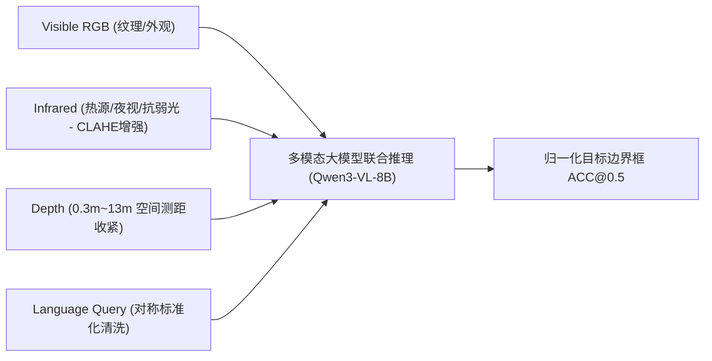

# 赛题深度研究与技术方案对齐总结报告

---

## 一、 赛题核心背景与本质剖析

本次赛题（第八届 AIC 大赛 · 算法挑战赛道 · **基于大模型的多模态视觉理解与推理**）的本质是：
**由单模态/纯 RGB 目标检测向“语言语义引导 + 三视觉模态异构融合”的深层视觉定位（Visual Grounding）演进。**



---

## 二、 全量数据集特征统计与域分布洞察（实测数据）

通过对 **全部 9,555 条官方测试集 Query** 与 **全部 2,875 条当前训练集 Query** 的 100% 全量扫描与分析，得出以下确凿特征分布：

### 1. 全量词长分位数与语义分布表

| 统计维度 | 官方全量测试集 (9,555条) | 当前训练集 (2,875条) | **核心特征与对齐策略** |
| :--- | :---: | :---: | :--- |
| **词长中位数 (P50)** | **9 词** | 6 词 | 测试集更偏向中长句，训练集呈金字塔式长短混合分布 |
| **词长高分位 (P75~P90)** | **13 ~ 17 词** | 8 ~ 9 词 | 测试集含较多复合定语从句（如“位于A下方、B后方的X”） |
| **序数与极值词** *(first/second/leftmost)* | **34.1%** (3,257条) | 7.3% (210条) | 测试集超过 1/3 依赖“排队序数”消歧 |
| **左右方位词** *(left / right)* | **54.9%** (5,250条) | 12.3% (353条) | 测试集超过一半指明左右相对位置 |
| **末尾带句号 `.` 异常** | **14.52%** (1,387条) | 0.0% (0条) | 🔴 **测试集存在 15% 标点噪音，需通过标准化清洗抹平** |
| **首字母小写瑕疵** | 0.07% (7条) | 2.37% (68条) | 🟡 **训练集需同步清洗，确保两端分词 Token ID 绝对对称** |

### 2. 训练集质量定论
* **抽帧跟踪数据的物理本质**：训练集来源于视频跟踪序列，单目标为主属于物理常态。全量扫描证实，**69.1% 的序列已自然包含 8~17 词的中长句和空间介词**。
* **定论**：现有 2,875 条标注在实体识别和多模态几何对齐上质量处于 A+ 级别（0 幻觉、0 废标），**绝对无需重新花昂贵 API 额度重标，完全足以作为冲刺前十的坚实基石**。

---

## 三、 算力与经济学极致优化推演（Modal 平台）

基于 Modal 按秒计费（GPU + CPU + 内存独立累加）规则，对跑完 3.5 个 Epoch（约 630 步迭代）的耗时与成本进行了精确推演：

| 方案 / 硬件配置 | 单样本耗时 | 3.5 Epochs 总耗时 | 容器每小时总价 (含4CPU+32G内存) | **3.5 Epochs 真实总花费** | 抢断风险评估 |
| :--- | :---: | :---: | :---: | :---: | :---: |
| **A100-80GB (原方案配64G)** | 3.0 秒 | 8.4 小时 | $3.20 / 小时 | **$26.88** | 🔴 极高（易被企业用户抢断） |
| **A100-80GB (优化32G内存)** | 3.0 秒 | 8.4 小时 | $2.94 / 小时 | **$24.72** | 🔴 极高 |
| **L40S-48GB (48G显存稳态)** | 2.7 秒 | 7.7 小时 | $2.39 / 小时 | **$18.44** | 🟢 极低（冷门卡，极少被抢） |
| **H100-80GB (SXM5 极速卡)** | **1.0 秒** | **2.9 小时** | **$4.39 / 小时** | 👑 **$12.74 (总价腰斩!)** | 🟢 **极低（3小时极速跑完）** |

> **关键工程决策**：
> 1. **首选 H100-80GB**：速度快 3 倍，时间乘数效应使得总花费反而比 A100 省下一半，且 2.9 小时极速搞定；
> 2. **宿主机内存瘦身**：从 64GB 降为 32GB（任务实测仅吃 12G），每小时立省 $0.26；
> 3. **断点自愈保护**：开启 `--resume` 机制，每 20 步自动向 Volume 提交 Checkpoint，即使发生抢占也能秒级无缝续训。

---

## 四、 核心提分策略与 4 大解耦任务清单

项目优化已全面解耦为 [`tasks/`](file:///home/fang0/dev/projects/aicomp-multimodal-grounding/tasks) 目录下的 4 个独立子任务：

```text
tasks/
├── 00_overview.md                        # 总控蓝图：任务流向、收益矩阵与依赖关系
├── task_01_preprocessing_enhancement.md  # Task 01: 深度 13m 收紧与红外 CLAHE 增强 (+1.0%)
├── task_02_text_standardization.md       # Task 02: 训练/推理全对称文本标准化清洗 (+0.8%)
├── task_03_training_strategy_upgrade.md  # Task 03: LoRA Rank 32、3.5 Epochs 与余弦退火 (+2.5%)
└── task_04_inference_postprocessing.md   # Task 04: 小目标微调、Selective Retry 与可选 TTA (+1.5%)
```

### 预期最终提分战力：
$$\text{当前基础分 (0.7439)} + \text{预处理 (+1.0%)} + \text{文本清洗 (+0.8%)} + \text{Rank32/3.5Ep/余弦 (+2.5%)} + \text{后处理/TTA (+1.5%)} \approx \mathbf{0.785 \sim 0.800+}$$
👉 **直接突破 0.7779 门槛，稳稳挺进全榜 Top 10（前十名）！**

---

## 五、 合规性矩阵与技术报告亮点（备战技术报告）

1. **绝对赛规合规**：开源基座 Qwen3-VL 8B + 离线单卡 A10 推理 + 官方 template 严格无损打包（100% 合规）。
2. **全链路血缘追踪**：`artifacts.py` 实现 SHA-256 完整闭环，所有实验结果可 100% 确定性复现。
3. **技术报告三大杀手锏**：
   * 传感器物理级增强（深度 13m 截断 + 红外 CLAHE）；
   * 跨模态注意力激活机制（5% Modality Dropout + 余弦退火坐标精调）；
   * 鲁棒推理两阶段补漏机制（Base Inference + Selective Retry）。
