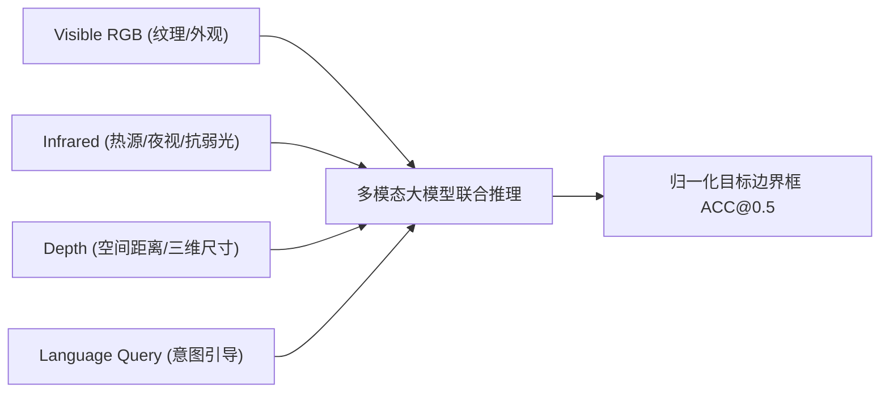

# 赛题深度研究与技术方案对齐总结报告

---

## 一、 赛题核心背景与本质剖析

本次赛题（第八届 AIC 大赛 · 算法挑战赛道 · **基于大模型的多模态视觉理解与推理**）的本质是：
**由单模态/纯 RGB 目标检测向“语言语义引导 + 三视觉模态异构融合”的深层视觉定位（Visual Grounding）演进。**



### 痛点与破局点
1. **多源异构模态差异**：RGB 图像具备丰富纹理，但受弱光、逆光影响；Infrared 突出活体/热源轮廓，但缺失色彩纹理；Depth 提供 30cm~20m 空间几何信息，但单通道 16 位与现有大模型预训练视觉编码器（如 CLIP/ViT）不兼容。
2. **语言与多模态空间对齐**：英文 Query 可能涉及方位词（“leftmost”、“beside the white lamp”）、属性词（“red sign”）或状态词，模型必须具备极强的跨模态多跳逻辑推理能力。

---

## 二、 当前项目实现方案与官方赛规的对齐性审查 (Compliance Matrix)

| 赛规要求 / 约束条件 | 官方规定 | 当前项目实现方案 | 合规评估 |
| :--- | :--- | :--- | :---: |
| **推理模型合规** | 严禁商业闭源 API（如 GPT-4o）在线推理，必须使用开源/自研模型自主部署 | 采用开源基座模型 [`Qwen/Qwen3-VL-8B-Instruct`](https://huggingface.co/Qwen/Qwen3-VL-8B-Instruct)，在本地/魔搭 DSW 单卡 A10 离线推理 | ✅ **100% 绝对合规** |
| **教师模型数据生成** | 允许使用外部开源数据或自建数据增强 | 采用开源教师模型 `GLM-4.6V` 仅在**离线阶段**合成训练集 Query，且严格通过 SHA-256 QC 与 Approved 审批 | ✅ **100% 绝对合规** |
| **测试集防穿越** | 严禁测试集参与训练、禁止测试集泄露 | [`scripts/filter_overlap.py`](file:///home/fang0/dev/projects/aicomp-multimodal-grounding/scripts/filter_overlap.py) 计算 SHA-256 图像指纹，严格剔除同源数据（`excluded_overlap.json` 审计） | ✅ **100% 绝对合规** |
| **深度图模态适配** | 原始数据为 16-bit 单通道深度图 | [`scripts/prepare_rgbdt.py`](file:///home/fang0/dev/projects/aicomp-multimodal-grounding/scripts/prepare_rgbdt.py) 渲染为 3 通道 JET 伪彩色编码，无缝适配大模型视觉编码器 | ✅ **100% 绝对合规** |
| **输出格式与坐标** | 必须为归一化 `[x1, y1, x2, y2]`，禁止修改其他字段，打包为 `submission.zip` | [`scripts/build_submission.py`](file:///home/fang0/dev/projects/aicomp-multimodal-grounding/scripts/build_submission.py) 强制校验官方 template SHA-256 并生成标准 zip | ✅ **100% 绝对合规** |

---

## 三、 当前项目的核心技术亮点（可直接写入技术报告）

1. **统一输入协议与双向无损分辨率**：
   * 采用统一的 `<|box_start|>(x1,y1),(x2,y2)<|box_end|>` 协议，训练与推理共享统一 Prompt 模版与哈希校验。
   * 图像像素预算设定为 `3072 * 28 * 28` 像素，保证 1920×1080 原图无损输入，保留微小目标的几何特征。
2. **高容错与自愈式数据工程 (Fault-Tolerant Data Pipeline)**：
   * 教师模型 Query 合成具备滑动窗口限流、场景级分片调度、确定性质检（QC）与发布审批机制（Approved）。
3. **全链路血缘指纹追踪 (Lineage & Reproducibility)**：
   * 基于 `artifacts.py` 实现 SHA-256 链式追踪，从数据切分 ➔ 标注生成 ➔ 训练 LoRA ➔ 推理评测形成闭环，杜绝脏数据注入。
4. **两阶段鲁棒推理与失败重试 (Two-Stage Robust Inference)**：
   * 离线推理配备 `Base Inference` + 强约束 `Retry Prompt` 补漏机制，极大消除拒答、格式异常与空框问题。

---

## 四、 后续进阶提分方向规划 (Roadmap & Action Items)

针对复赛冲榜与半决赛晋级，后续可探索以下提分优化方向：

```text
提分方向
  ├── 1. 深度图编码增强 (Depth Encoding):
  │        探索除 JET 外的伪彩色方案（如 Surface Normal 法向量编码、HHA 编码），测试多通道几何表征能力。
  │
  ├── 2. 模态对齐增强与数据增强 (Data Augmentation):
  │        增加低照度、模糊、遮挡等多模态合成退化样本，强化红外与深度模态的抗干扰权重。
  │
  ├── 3. 多模型集成与 BBox 融合 (Ensemble & WBF):
  │        采用多 Checkpoint 或不同 LoRA Rank 模型输出，使用加权框融合（Weighted Boxes Fusion, WBF）提高 IoU。
  │
  └── 4. 技术报告与答辩材料准备:
           按照 docs/research/competition_rules.md 中的 7 大章节提前整理实验消融数据与架构图。
```
