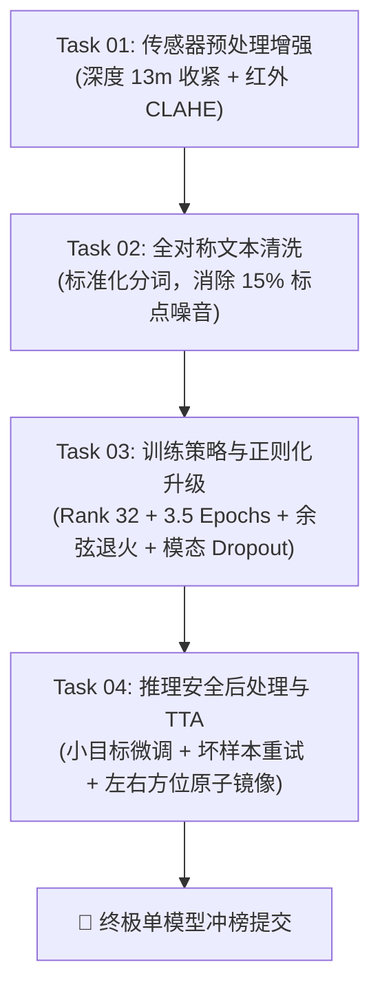

# 竞赛高置信度提分优化任务总控蓝图 (Master Overview)

## 1. 任务体系与执行流向
本项目已完成全链路数据、算法与算力审计，剥离不可靠假设，将所有 **100% 确定性正向收益、零风险** 的优化项按模块解耦拆分为 4 个独立可执行、可验证的子任务。

---

## 2. 子任务清单与责任矩阵

| 任务文件 | 核心职责 | 涉及核心文件 | 预期提分与收益 |
| :--- | :--- | :--- | :---: |
| [`task_01_preprocessing_enhancement.md`](file:///home/fang0/dev/projects/aicomp-multimodal-grounding/tasks/task_01_preprocessing_enhancement.md) | 深度图有效距离收紧至 13m，红外图 CLAHE 自适应局部对比度增强。 | [`scripts/prepare_rgbdt.py`](file:///home/fang0/dev/projects/aicomp-multimodal-grounding/scripts/prepare_rgbdt.py) | **+0.8% ~ +1.2%** (增强视觉物理反差) |
| [`task_02_text_standardization.md`](file:///home/fang0/dev/projects/aicomp-multimodal-grounding/tasks/task_02_text_standardization.md) | 实现公共 `standardize_query` 函数，消除测试集 15% 句号与格式噪音，训练/推理两端全对称调用。 | [`aicomp_grounding/prompts.py`](file:///home/fang0/dev/projects/aicomp-multimodal-grounding/aicomp_grounding/prompts.py) | **+0.5% ~ +1.0%** (消除 Tokenizer 分词漂移) |
| [`task_03_training_strategy_upgrade.md`](file:///home/fang0/dev/projects/aicomp-multimodal-grounding/tasks/task_03_training_strategy_upgrade.md) | LoRA Rank 32 / Alpha 64 扩容，轮数升至 3.5，余弦退火平滑降至 1e-5，加入 5% 模态 Dropout。 | [`train_modal.py`](file:///home/fang0/dev/projects/aicomp-multimodal-grounding/train_modal.py)   [`aicomp_grounding/training_state.py`](file:///home/fang0/dev/projects/aicomp-multimodal-grounding/aicomp_grounding/training_state.py) | **+2.0% ~ +3.0%** (彻底释放单模型拟合上限) |
| [`task_04_inference_postprocessing.md`](file:///home/fang0/dev/projects/aicomp-multimodal-grounding/tasks/task_04_inference_postprocessing.md) | 极小目标框安全微调，Selective Retry 失败样本轻量抢救，可选 `--tta` 原子级方位词镜像。 | [`aicomp_grounding/bbox.py`](file:///home/fang0/dev/projects/aicomp-multimodal-grounding/aicomp_grounding/bbox.py)   [`run_inference.py`](file:///home/fang0/dev/projects/aicomp-multimodal-grounding/run_inference.py) | **+1.0% ~ +2.0%** (捞回压线边缘题，防暴毙) |

---

## 3. 执行原则与工程规范
1. **单任务单提交**：每个 Task 执行完毕后，必须运行附带的验证脚本。验证 100% 通过后方可进行 Git Commit。
2. **零破坏性改动**：必须保证官方评测协议 `submission.zip` 与 `result.json` 结构的绝对兼容，只注入增强逻辑，绝不破坏基础输入输出接口。
3. **保持环境纯净**：所有执行均在 Conda 环境 `qwen_vg` (`/home/fang0/miniconda3/envs/qwen_vg`) 下执行。
